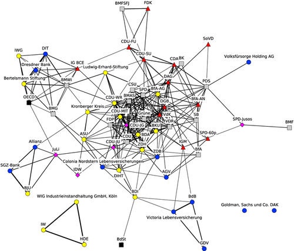
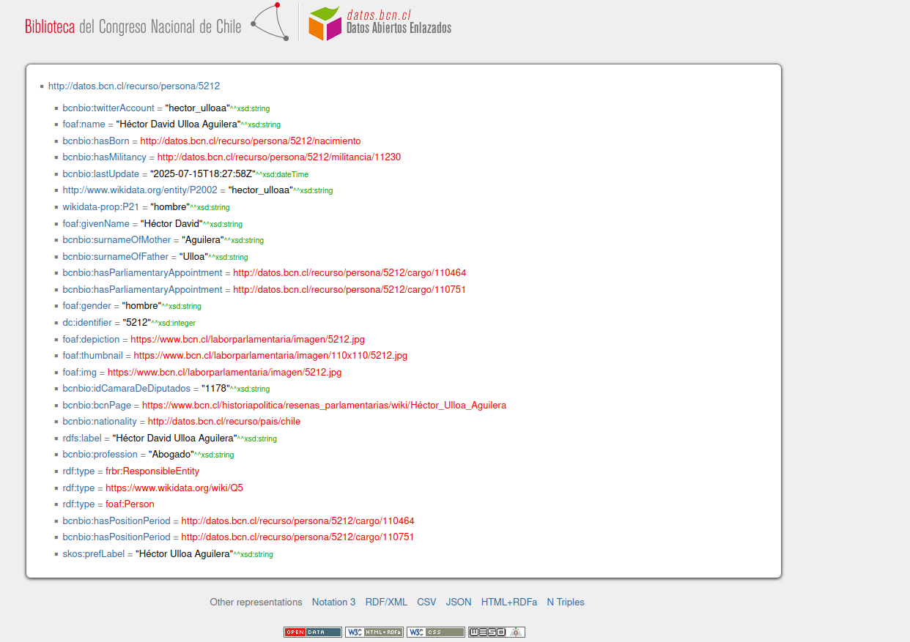

## Resumen metodológico

Aunque aún no definida por completo, la metodología escogida nos otorga los supuestos relevantes para extraer y limpiar los datos de forma que sean útiles posteriormente. Tentativamente, utilizaremos **Discourse Network Analysis** [@leifeld_discourse_2017], que entiende el discurso como un fenómeno de red, ya que las declaraciones de los actores son interdependientes entre sí, de forma temporal y transversal, y comúnmente están dirigidas hacia otros actores, lo que constituye una **acción relacional.** El DNA combina técnicas de análisis de contenido discursivo, análisis descriptivo de redes y análisis inferencial de redes para describir las estructuras de los discursos políticos y comprender sus procesos generativos. Esta técnica permite capturar la agrupación de actores (**coaliciones**), la agrupación temporal (**ciclos de atención**) y la agrupación en torno a conceptos (**frames**). Esto nos permitirá, entre otras cosas, evaluar el nivel de cooperación y conflicto y la polarización en el debate, entender sistemáticamente como el poder da forma al discurso, y tomar en consideración el tiempo y la competencia entre coaliciones opuestas al analizar los conceptos teóricos que nos interesan. El mayor potencial que tiene esta perspectiva para nuestra investigación es lograr transformar el debate, por naturaleza no estructurado y disperso, en contenido con estructura clara y analizable, para atacar de forma efectiva las hipótesis y preguntas que nos interesan. Sumado a esto, el DNA ofrece categorías y variables claras y delimitadas, perfectas para realizar un análisis con Inteligencia Aumentada como el que propone esta investigación.

### Variables:

La unidad básica de análisis en el DNA es una declaración **(statement).** Se compone de las siguientes variables:

- **Actores:** Organizaciones o sujetos. Deben definirse de forma clara antes de empezar a analizar. En este caso, utilizaremos a los sujetos, añadiendo la organización (comúnmente el partido) como una categoría adicional de análisis a posteriori.

- **Conceptos:** puede ser tanto afirmaciones sobre políticas (desde la perspectiva de las *advocacy coalitions*) o justificaciones/narrativas (desde la perspectiva de las *discourse coalitions*). Para nuestra investigación, probablemente utilizaremos *discourse coalitions*, pero es algo que queda por definir y requiere de una teoría auxiliar para ser operacionalizado.

- **Acuerdo:** Relación de acuerdo entre el actor y el concepto. Es un calificador dicotómico, tomando valor 1 si el actor se refiere al concepto de forma afirmatoria, y 2 si el actor rechaza el concepto o usa una connotación negativa. Es una distinción crucial, ya que los actores usualmente discuten los mismos conceptos, pero con un posicionamiento diferente o muchas veces opuesto. Metodologías como el análisis de tópicos no serían capaces de capturar esta complejidad.

- **Tiempo:** El momento en que la declaración se emite. Por el momento, la estamos operacionalizando de dos formas:

  1.  Utilizamos el día de la discusión para temporalizar cada debate entre sí.

  2.  Utilizamos un time step discreto interno a cada debate, para capturar posibles influencias entre actores o referencias a otras declaraciones (t=1, t=2, ..., t=n).

### Ejemplo de codificación

Existen métodos inferenciales que aún no he explorado (y pueden llegar a influenciar el procedimiento), pero por el momento esta sería la forma más básica de codificación:

**Actor -\> acuerdo -\> concepto (en un time step específico)**

Para nuestro caso podría ser:

Johannes Kayser -\> Desacuerdo -\> Solidaridad Intergeneracional

O también:

Johannes Kayser -\> Acuerdo -\> Estado ineficiente

Una posibilidad es construir diccionarios de conceptos análogos a nuestras categorías teóricas, como en este ejemplo muy simplificado:

```{python}
#| eval: false
market_justice = ["capitalización individual", "ineficiencia del Estado", "administración privada", "administraciones de fondos de pensiones", "mérito personal"]
political_justice = ["sistema de reparto", "solidaridad intergeneracional", "administración estatal", "derecho a pensiones dignas"]
```

Esta es una forma muy simplificada (y por desarrollarse), ya que en realidad debería ser más parecido a esto:

```{python}
#| eval: false
market_justice = {
    "AFP": ["administradoras de fondos de pensiones", "administradoras actuales", "administración privada de las pensiones"]
}
political_justice = {
    "sistema de reparto": ["el sistema anterior", "... ejemplos"]
}
```

En último término, esto permite construir grafos y analizar el dinamismo de los clusters de forma descriptiva (aún sin utilizar métodos más avanzados), como en este ejemplo del análisis del discurso en torno a las pensiones en Alemania [@leifeld_reconceptualizing_2013]:



## Línea de tiempo y revisión de datos ley 21.735

Se revisó la calidad de los datos extraídos (más adelante en el documento) y el contenido de cada documento, para identificar cuáles contienen información discursiva relevante para analizar y caracterizar temporalmente eventos relevantes en la historia de la ley.

### Primer Trámite Constitucional: Cámara de Diputados (2022/11/07 - 2024/01/24)

- 1.1 Mensaje inicial (2022/11/07): xml y texto limpio revisados. Mensaje inicial del presidente de la república y primera versión de la ley. **Relevancia alta** para el análisis, especialmente el discurso inicial que contiene la justificación de la ley.

- Informes asociados (2022/11/07): [Informe Financiero](data/informes/informe_financiero.pdf), [Informe de Sustentabilidad de los Fondos de Cesantía](data/informes/informe_sustentabilidad_fondos_cesantia.pdf), [Informe de Impacto Regulatorio](data/informes/informe_impacto_regulatorio.pdf), [Informe Técnico](data/informes/informe_tecnico.pdf)

- 1.2 Oficio a la Corte Suprema (2022/11/04): xml y texto limpio revisados. Se solicita un análisis de constitucionalidad de la ley a la corte suprema, es un documento técnico, sin contenido discursivo significativo. **Relevancia baja/nula para el análisis.**

- [Informe del Consejo Consultivo Previsional (2022/11/28)](data/informes/informe_consejo_consultivo.pdf)

- 1.3 Oficio de la corte suprema (2023/01/11): xml y texto limpio revisados. Realiza un análisis de la constitucionalidad de la ley, pero es un documento técnico, sin contenido discursivo significativo. **Relevancia baja/nula para el análisis.**

- **Nota: entre el proyecto inicial y el trámite 1.4 hubieron modificaciones al proyecto de ley, muchas de las cuáles el presidente revierte. Hay que encontrarlas. Relevancia alta para generar línea de tiempo de cambios del proyecto.**

- 1.4 Oficio indicaciones del ejecutivo (2023/12/21): xml y texto limpio revisados. Realiza modificaciones al proyecto realizado, principalmente intercambiando administradoras de fondos de pensiones por Inversores de Pensiones. **Relevancia baja/nula para el análisis, relevancia alta para generar línea de tiempo de cambios del proyecto.** Informe asociado: [Informe Financiero Sustitutivo](data/informes/informe_financiero_sustitutivo.pdf)

- 1.5 Oficio indicaciones del ejecutivo (2024/01/09): xml y texto limpio revisados. Retira el anterior oficio de indicaciones, y añade el Sistema de Información de Pensiones, retrocediendo con muchas de las propuestas de la reforma. **Relevancia baja/nula para el análisis, relevancia alta para generar línea de tiempo de cambios del proyecto.** Informe asociado: [Informe Financiero Complementario](data/informes/informe_financiero_complementario.pdf)

- 1.6 Oficio indicaciones del ejecutivo (2024/01/10): xml y texto limpio revisados. Retira y formula indicaciones al proyecto de ley (principalmente establece por ley una Comisión de Usuarios del Sistema de Pensiones). **Relevancia baja/nula para el análisis, relevancia alta para generar línea de tiempo de cambios del proyecto.** Informe asociado: [Informe Financiero Complementario](data/informes/informe_financiero_complementario_2.pdf)

- 1.7 Informe de Comisión de Trabajo Cámara de Diputados (2024/01/15): xml y texto limpio revisados. Contiene un resumen de las sesiones, los asistentes a ellas, mucha información técnica, y los resultados del informe (votaciones, cambios al proyecto), pero no aporta contenido discursivo significativo. **Relevancia baja/nula para el análisis, relevancia alta para el procesamiento de los videos de sesiones, relevancia alta para generar línea de tiempo de cambios del proyecto.**

**Nota: Hay que encontrar (y transcribir) los videos de las sesiones de esta comisión y las siguientes. Las actas existentes están neutralizadas y no mantienen bien la dirección y tono de los statements.**

- 1.8 Oficio indicaciones del ejecutivo (2024/01/15): xml y texto limpio revisados. Retira y formula indicaciones al proyecto de ley. Establece la cotización adicional del 6% entre 3% a las cuentas individuales y otro 3% a solidaridad intergeneracional. **Relevancia baja/nula para el análisis, relevancia alta para generar línea de tiempo de cambios del proyecto.** Informe asociado: [Informe Financiero Complementario](data/informes/informe_financiero_complementario_3.pdf)

- 1.9 Oficio indicaciones del ejecutivo (2024/01/19): xml y texto limpio revisados. Retira y formula indicaciones al proyecto de ley (principalmente en aplica un incremento gradual al aumento de la PGU). **Relevancia baja/nula para el análisis, relevancia alta para generar línea de tiempo de cambios del proyecto.** Informe asociado: [Informe Financiero Complementario](data/informes/informe_financiero_complementario_4.pdf)

- 1.10 Informe de Comisión de Hacienda Cámara de Diputados (2024/01/22): xml y texto limpio revisados. Contiene un resumen de las sesiones, los asistentes a ellas, mucha información técnica, y los resultados del informe (votaciones, cambios al proyecto), pero no aporta contenido discursivo significativo. **Relevancia baja/nula para el análisis, relevancia alta para el procesamiento de los videos de sesiones.**

- 1.11 Oficio indicaciones del ejecutivo (2024/01/22): xml y texto limpio revisados. Retira y formula indicaciones al proyecto de ley (principalmente, establece límites a las comisiones). **Relevancia baja/nula para el análisis, relevancia alta para generar línea de tiempo de cambios del proyecto.** Informe asociado: [Informe Financiero Complementario](data/informes/informe_financiero_complementario_5.pdf)

- 1.12 Discusión en Sala (2024/01/23): xml y texto limpio revisados. Contiene el discurso de los parlamentarios en la discusión en sala, con un alto contenido discursivo significativo. **Relevancia alta para el análisis.**

- 1.13 Discusión en Sala (2024/01/24): xml y texto limpio revisados. Contiene el discurso de los parlamentarios en la discusión en sala, con un alto contenido discursivo significativo. **Relevancia alta para el análisis.**

**Nota: Acá se rechazó el artículo 2, que establecía el 6 % (no sé exactamente qué proporción)**

- 1.14 Oficio de Cámara Origen a Cámara Revisora (2024/01/24): xml y texto limpio revisados. Entrega del proyecto de ley aprobado luego de las discusiones y comisiones técnicas al Senado. **Relevancia baja/nula para el análisis, relevancia alta para generar línea de tiempo de cambios del proyecto.**

### Segundo trámite constitucional: Senado (2025/01/22 - 2025/01/29)

p\. 293-468 requerimiento de inconstitucionalidad: - 15 de enero de 2025: Se recibió el [Oficio N° 312-372 del Presidente de la República](data/informes/indicaciones_presidente.pdf), que formuló 176 páginas de indicaciones al proyecto.

- 2.1 Informe de Comisión de Trabajo Senado (2025/01/22): xml y texto limpio revisados. Contiene un resumen de las sesiones, los asistentes a ellas, mucha información técnica, y los resultados del informe (votaciones, cambios al proyecto), pero no aporta contenido discursivo significativo. **Relevancia baja/nula para el análisis, relevancia alta para el procesamiento de los videos de sesiones, relevancia alta para generar línea de tiempo de cambios del proyecto.**

- 2.2 Informe de Comisión de Hacienda Senado (2025/01/26): xml y texto limpio revisados. Contiene un resumen de las sesiones, los asistentes a ellas, mucha información técnica, y los resultados del informe (votaciones, cambios al proyecto), pero no aporta contenido discursivo significativo. **Relevancia baja/nula para el análisis, relevancia alta para el procesamiento de los videos de sesiones, relevancia alta para generar línea de tiempo de cambios del proyecto.**

- 2.3 Oficio a la Corte Suprema (2025/01/26): xml y texto limpio revisados. Se solicita un análisis de constitucionalidad de la ley a la corte suprema, es un documento técnico, sin contenido discursivo significativo. **Relevancia baja/nula para el análisis.**

- 2.4 Discusión en Sala (2025/01/27): xml y texto limpio revisados. Contiene el discurso de los parlamentarios en la discusión en sala, con un alto contenido discursivo significativo. **Relevancia alta para el análisis.**

- 2.5 Oficio de Cámara Revisora a Cámara Origen (2025/01/28): xml y texto limpio revisados. Aprobación con modificaciones, reporta los cambios realizados al proyecto presentado por la Cámara de Diputados. **Relevancia baja/nula para el análisis, relevancia alta para generar línea de tiempo de cambios del proyecto.**

- 2.6 Oficio de la Corte Suprema a la Comisión (2025/01/29): xml y texto limpio revisados. Realiza un análisis de la constitucionalidad de la ley, principalmente las últimas modificaciones realizadas en respuesta al último informe de la corte suprema. **Relevancia baja/nula para el análisis.**

### Tercer trámite constitucional: Cámara de Diputados (2025/01/29 - 2025/01/29)

- 3.1 Discusión en Sala (2025/01/29): xml y texto limpio revisados (xml Akoma Ntoso buggeado). Contiene el discurso de los parlamentarios en la discusión en sala, con un alto contenido discursivo significativo. Discusión donde se revisan y discuten los cambios realizados por el Senado y el proyecto final para aprobarlo de forma definitiva. **Relevancia alta para el análisis.**

- 3.2 Oficio de Cámara Revisora a Cámara Origen (2025/01/29): xml y texto limpio revisados. Aprobación de modificaciones realizadas por el Senado. **Relevancia baja/nula para el análisis, relevancia alta para generar línea de tiempo de cambios del proyecto.**

### Cuarto trámite constitucional: Tribunal Constitucional (2025/01/29 - 2025/03/07)

- 4.1 Oficio de Cámara de Origen al Ejecutivo (2025/01/29): xml y texto limpio revisados. Envío del proyecto de ley aprobado por ambas cámaras al ejecutivo para su promulgación, consulta de facultad de veto. **Relevancia baja/nula para el análisis, relevancia alta para generar línea de tiempo de cambios del proyecto.**

Oficio N° 018-372 (presidente no ejerce facultad de veto).

- 4.2 Oficio al Tribunal Constitucional (2025/01/30): xml y texto limpio revisados. Envío del proyecto de ley al Tribunal Constitucional para examen constitucional, presidente no hizo uso de su facultad de veto. **Relevancia baja/nula para el análisis.**

- 4.3 Oficio al Tribunal Constitucional (2025/02/10): xml y texto limpio revisados. Requerimiento de inconstitucionalidad de artículos por incumplimiento. **Relevancia baja/nula para el análisis, relevancia alta para generar línea de tiempo de cambios del proyecto.**

- [Requerimiento de inconstitucionalidad](data/informes/requerimiento_inconstitucionalidad.pdf). **Relevante para el análisis y para la línea de tiempo.** Se declara que indicaciones del presidente van en contra de objetivos del proyecto (refuerzo de la libertad de elección, disminución del riesgo individual y eficiencia del sistema) y se realizaron muy pronto a la finalización de la tramitación. Se declara que la cámara baja tuvo tiempo insuficiente para analizar el proyecto, ya que el tercer trámite constitucional duró menos de 24 horas y no se realizaron sesiones de comisión técnica. Principalmente el capítulo 1 tiene mucho contenido discursivo, en adelante es justificación técnica de la inconstitucionalidad. \*\*Firmado por el diputado Roberto Arrroyo Muñoz.

La inconstitucionalidad fue solicitada también por más de un cuarto de los diputados: Roberto Arroyo Muñoz, Yovana Ahumada Palma, René Alinco Bustos, Jaime Araya Guerrero, Cristián Araya Lerdo de Tejada, Chiara Barchiesi Chávez, Bernardo Berger Fett, Sergio Bobadilla Muñoz, Álvaro Carter Fernández, Sofía Cid Versalovic, Sara Concha Smith, Gonzalo De la Carrera Correa, Catalina Del Real Mihovilovic, Jorge Durán Espinoza, Camila Flores Oporto, Mauro González Villarroel, Juan Irarrázaval Rossel, Pamela Jiles Moreno, Harry Jürgensen Rundshagen, Johannes Kaiser Barents-Von Hohenhagen, Cristian Labbé Martínez, Enrique Lee Flores, Christian Matheson Villán, José Carlos Meza Pereira, Benjamín Moreno Bascur, Francesca Muñoz González, Gloria Naveillan Arriagada, Víctor Alejandro Pino Fuentes, Jorge Rathgeb Schifferli, Gaspar Rivas Sánchez, Agustín Romero Leiva, Leonidas Romero Sáez, Luis Sánchez Ossa, Stephan Schubert Rubio, Hotuiti Teao Drago, Renzo Trisotti Martínez, Cristóbal Urruticoechea Ríos y Sebastián Videla Castillo.

- **Nota: Para esta fecha ya estaba el 1.5% hacia el fondo solidario y el "préstamo" al Estado. Hay que identificar específicamente cuando se ingresó esta medida.**

- 4.4 Oficio del Tribunal Constitucional (2025/03/03): xml y texto limpio revisados. Sentencia de Requerimiento de Inconstitucionalidad, lo declara inadmisible. **Relevancia baja/nula para el análisis, relevancia alta para generar línea de tiempo de cambios del proyecto.**

- 4.5 Oficio del Tribunal Constitucional (2025/03/07): xml y texto limpio revisados. Sentenceia del Tribunal Constitucional. Declara constitucional todo lo consultado. **Relevancia baja/nula para el análisis, relevancia alta para generar línea de tiempo de cambios del proyecto.**

### Quinto trámite constitucional: Trámite de Finalización, Cámara de Diputados (2025/03/11 - 2025/03/11)

- 5.1 Oficio de Cámara de Origen al Ejecutivo (2025/03/11): xml y texto limpio revisados. Envío del proyecto finalizado para firma del presidente. **Relevancia baja/nula para el análisis, relevancia alta para generar línea de tiempo de cambios del proyecto.**

### Sexto trámite constitucional: Promulgación de Ley en Diaro Oficial (2025/03/20 - 2025/03/20)

- 6.1 Publicación en Diario Oficial (2025/03/20): xml y texto limpio revisados. Publicación de la ley en el diario oficial, con el texto final aprobado por el Tribunal Constitucional. **Relevancia baja/nula para el análisis, relevancia alta para generar línea de tiempo de cambios del proyecto.**

## Procesamiento de datos

### Descarga de datos

Utilizamos el paquete de python `bcn_scraper` de desarrollo propio para descargar de forma automatizada los datos tramitación de la ley 21.735, y procesar los datos para obtener el discurso de forma limpia, normalizada y enriquecida. En primer lugar, descargamos todos los datos de la tramitación ingresando el número de ley. La función nos otorga un dataframe con todos los documentos de cada trámite y metadatos como la fecha, número de trámite y URL de cada documento. Este bloque de código demora un tiempo considerable, ya que se descargan los documentos y el Akoma Ntoso (AKN) de cada trámite, y se procesan para obtener el texto limpio. Específicamente para el AKN, se requirió desarrollar una función para reintentar la descarga con un mayor tiempo de espera, ya que solían presentar errores.
```{python}
#| eval: false
from bcn_scraper.wrapper import historia_dataframe_from_ley_o_boletin
from bcn_scraper.akoma_ntoso import debug_akoma_ntoso_errors
from bcn_scraper import collect_unlabeled_speaker_candidates

df = historia_dataframe_from_ley_o_boletin(numero_ley="21735", clean_text=True, fetch_akn=True)

# Implementa reintentos sobre filas con errores
df_debugged = debug_akoma_ntoso_errors(
    df,
    timeout = 90,
    max_attempts = 3,
    backoff_seconds= 2.0
    )

df_debugged.to_csv("data/datos_bcn_akn.csv", index=False, sep = ";")
```

### Filtrado de trámites irrelevantes

Para el análisis final, solo necesitaremos los trámites que contengan contenido discursivo significativo, por ejemplo, los diarios de sesión y el mensaje inicial. Otros documentos, como los oficios, son méramente técnicos y no aportan a la investigación. A continuación, obtenemos un dataframe con solo los trámites relevantes.

```{python}
#| eval: false
import pandas as pd
from pathlib import Path
data = pd.read_csv("data/datos_bcn_akn.csv", sep = ";")

data_analysis = data[
    data["title"].str.contains("Discusión en Sala|Mensaje|Informe", case=False, na=False)
]
```

### Extracción y normalización de datos discursivos

Extraemos el discurso desde los diarios de sesión, dividido por párrafo y separado por hablante. Los datos ya están en su gran mayoría etiquetados, ya que estamos utilizando los identificadores de hablantes y tipos de intervenciones presentes en el Akoma Ntoso (AKN) de la Biblioteca del Congreso Nacional. Para esto, utilizamos la función `add_speech_content`.

A continuación, se muestra un ejemplo de un documento AKN que fue procesado:

```{xml}
<!-- Metadata al principio documento con id del diputado. Luego nos será de gran utilidad. -->
<meta>
<references source="#org149">
<TLCPerson id="per67" showAs="hector ulloa aguilera" href="http://datos.bcn.cl/recurso/persona/5212"/>
<references</>
<meta/>

<!-- Una participación al azar como ejemplo -->
<debateSection name="Participacion" refersTo="#per67" id="akn704142-po1-ds3-ds10" bcn:uriTipoParticipacion="#Intervencion" bcn:uriRol="#editorIdDiputado">
<p id="akn704142-po1-ds3-ds10-p392">La señora HERTZ, doña Carmen (Vicepresidenta).-</p>
<p id="akn704142-po1-ds3-ds10-p393"/>
<p id="akn704142-po1-ds3-ds10-p394"> Tiene la palabra el diputado Héctor Ulloa . </p>
<p id="akn704142-po1-ds3-ds10-p395"/>
<p id="akn704142-po1-ds3-ds10-p396">El señor ULLOA.-</p>
<p id="akn704142-po1-ds3-ds10-p397"/>
<p id="akn704142-po1-ds3-ds10-p398">
Señora Presidenta, llevamos años de rotundos fracasos en materia previsional, y este es el tercer intento de tener un mínimo común para avanzar en pensiones dignas para nuestros adultos mayores.
</p>
<!-- ... -->
<p id="akn704142-po1-ds3-ds10-p407">
Por eso, estimados colegas, hoy hago un llamado a la empatía. Muy pronto veremos el debate de las isapres. Hoy nos dicen “Con tu platita, no”; pero las isapres dicen “Con tu platita, sí”. Por eso hago un llamado a la empatía. Somos cotizantes privilegiados dentro del sistema, pero la realidad…
</p>
<p id="akn704142-po1-ds3-ds10-p408">-Aplausos.</p>
<p id="akn704142-po1-ds3-ds10-p409"/>
</debateSection>
```

Sin embargo, parte del discurso no está etiquetado, principalmente el discurso de los ministros, que no son parlamentarios, y por lo tanto no cuentan con identificador ni etiquetas en el Akoma Ntoso. Para esto, se realizó un proceso de normalización del discurso, donde se identifican los fragmentos de texto no etiquetados, y se genera la misma estructura presente en las demás intervenciones. Además, se identificaron eventos como los preámbulos (cuando se le da la palabra al hablante) y los eventos como aplausos o manifestaciones de las tribunas, etiquetandolos y dividiendolos de la intervención. Se utiliza la función `normalize_speech_content`.

```{python}

import json
import pandas as pd
from bcn_scraper import add_speech_content, normalize_speech_content, collect_unlabeled_speaker_candidates, build_parliamentarian_table, debug_parliamentarian_data_errors, build_speech_analysis_dataframe

data_speech = add_speech_content(data_analysis)

external_speakers_dict = {
        "JARA": {
            "speaker": "Jeannette Jara",
            "speaker_id": "PersonaExt1",
            "speaker_href": "https://es.wikipedia.org/wiki/Jeannette_Jara",
            "role": "Ministra del Trabajo y Previsión Social",
        },
        "MARCEL": {
            "speaker": "Mario Marcel",
            "speaker_id": "PersonaExt2",
            "speaker_href": "https://es.wikipedia.org/wiki/Mario_Marcel",
            "role": "Ministro de Hacienda",
        },
        "CIFUENTES": {
            "speaker_id": "per0"
        },
    }

dict_session_24 = {
        # Discusión Senado 2.4
        "ALLENDE": {
            "speaker_id": "PersonaAut7"
        },
        "ARAVENA": {
            "speaker_id": "PersonaAut11"
        },   
        "ARAYA": {
            "speaker_id": "PersonaAut5"
        },
        "CHAHUAN": {
            "speaker_id": "PersonaAut43"
        },
        "CRUZ COKE": {
            "speaker_id": "PersonaAut39"
        },
        "EBENSPERGER": {
            "speaker_id": "PersonaAut14"
        },
        "GARCIA": {
            "speaker_id": "PersonaAut9"
        },
        "GUZMAN": {
            "speaker": "Raul Guzmán Uribe",
            "speaker_id": "PersonaExt3",
            "speaker_href": "NA",
            "role": "Secretario General del Senado"
        },
        "INSULZA": {
            "speaker_id": "PersonaAut25"
        },
        "KUSANOVIC": {
            "speaker_id": "PersonaAut20"
        },
        "LAGOS": {
            "speaker_id": "PersonaAut34"
        },
        "MOREIRA": {
            "speaker_id": "PersonaAut12"
        },
        "NUNEZ": {
            "speaker_id": "PersonaAut15"
        },
        "OSSANDON": {
            "speaker_id": "PersonaAut87"
        },
        "PROHENS": {
            "speaker_id": "PersonaAut33"
        },
        "PROVOSTE": {
            "speaker_id": "PersonaAut40"
        },
        "WALKER": {
            "speaker_id": "PersonaAut6"
        },
}

data_normalized = normalize_speech_content(
    data_speech,
    split_transcription_events=True,
    clean_labeled=True,
    external_speakers=external_speakers_dict,
)

dict_normalized = data_normalized.to_dict(orient="records")

# Identificación de parlamentarios externos o no etiquetados
candidates = collect_unlabeled_speaker_candidates(data_normalized)

speech_df_full = pd.read_parquet("data/speech_df_full.parquet")
```

Así quedan los datos (simplificados) luego de normalizarlos, con el ejemplo de la intervención de Jeanette Jara que no estaba etiquetada en el AKN:

```{python}

{
 'kind': 'participation', 
 'time_step': 26, 
 'speaker_id': 'PersonaExt1', 
 'speaker': 'Jeannette Jara', 
 'speaker_href': 'https://es.wikipedia.org/wiki/Jeannette_Jara', 
 'role': 'Ministra del Trabajo y Previsión Social'
 'content': ['Señora Presidenta, quiero partir este importante día, en que se pone en el centro este debate previsional, esta sentida demanda ciudadana que lleva tanto tiempo pendiente en nuestro país, saludando cordial y fraternalmente la presencia de todas las fuerzas políticas representadas en el Congreso Nacional, a través de las diputadas y los diputados de la república, quienes tienen un rol y una labor muy importante en representar a sus electores, en una democracia que debería salir fortalecida después de este debate, que ha sido de tan largo aliento, donde hemos estado más de una década tratando de hacernos cargo de la insuficiencia de un sistema de pensiones que tiene a la mayoría de los pensionados del país viviendo en condiciones muy precarias, de mucha necesidad y angustia.', 
'...',
'Por eso, el gobierno del Presidente Gabriel Boric ha presentado hoy, en palabras del ministro de Hacienda, Mario Marcel , las ideas centrales del proyecto de cumplimiento tributario, para combatir la evasión y la elusión…']
}

{
 'kind': 'transcription_event', 
 'time_step': 27, 
 'type': 'Transcription event', 
 'content': ['(Aplausos)']
}
```

## Extracción de datos de parlamentarios

Luego, se extrayeron los datos relevantes de los parlamentarios, estructurándolos en un dataframe. Se tomaron dos estrategias:

- Para los parlamentarios etiquetados en el AKN, se obtuvieron los datos desde la misma plataforma.

- Para los parlamentarios no etiquetados, se proporcionó un link de Wikipedia, obteniendo luego exactamente los mismos datos.

BCN tiene una gran base de datos no estructurada. Una página de parlamentario se ve asi. Tomamos el mismo ejemplo que se mostró más arriba:

Se accedió al formato JSON de esta misma plataforma, extrayendo todos los datos relevantes, como el género, el partido y la edad. En algunos casos, como en el del partido, fue necesario acceder a dos URL adicionales luego de esta. El siguiente bloque de código puede demorar mucho tiempo (\~30 minutos). Solo se extrayó la última militancia de cada parlamentario por el largo tiempo de espera.

```{python}
parliamentarians = build_parliamentarian_table(data_normalized, include_all_militancies=False, fetch_militancy_dates=False, timeout=30, max_attempts=1)

# Función para reintentar con más tiempo en los casos con errores
parliamentarians_full = debug_parliamentarian_data_errors(
    parliamentarians,
    include_all_militancies=False, fetch_militancy_dates=False,
    timeout=60,
    max_attempts=5,
    backoff_seconds=3,
)
# Guardamos en parquet
parliamentarians_full.to_parquet("data/parliamentarians.parquet")
```

## Dataframe consolidado

```{python}
parliamentarians = pd.read_parquet("data/parliamentarians.parquet")

speech_df = build_speech_analysis_dataframe(
    data_normalized,
    parliamentarians=parliamentarians_debug,
)

# Incluye intervenciones como aplausos, abucheos y preámbulos

speech_df_full = build_speech_analysis_dataframe(
    data_normalized,
    parliamentarians=parliamentarians_debug,
    include_transcription_events=True,
    include_preambles=True,
    include_unresolved=True,
)
speech_df.to_parquet("data/speech_df.parquet")

speech_df_full.to_parquet("data/speech_df_full.parquet")
```

# Identificación de sesiones en comisiones técnicas

# Descarga de videos de sesiones en SenadoTV y cámara de diputados

# Reconocimiento automático de hablantes (ASR)

# Matching manual con personas reales

# Identificación de hablantes

# Dataframe a formato long y lógica de chunking

#