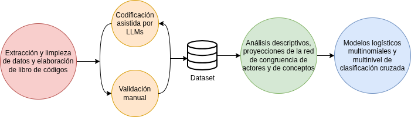

Universidad de Chile

Facultad de Ciencias Sociales

Departamento de Sociología  
Carrera de Sociología

Memoria para optar al título profesional de Sociólogo/a

**Resiliencia de la capitalización individual: Mapeando redes discursivas de justicia social en el debate previsional chileno**

**AUTOR/A: Ismael Aguayo**

**PROFESOR GUÍA: Juan Carlos Castillo**

**FECHA: 30 de junio de 2026**

Memoria desarrollada en el marco del proyecto de Fondecyt Nº 1250518 y el Centro Nacional de Inteligencia Artificial CENIA FB210017, Financiamiento Basal ANID

[**Abstract	4**](#abstract)

[**Introducción	5**](#introducción)

[**1\. La dimensión moral y normativa en el debate previsional	8**](#1.-la-dimensión-moral-y-normativa-en-el-debate-previsional)

[1.1. Justicia de mercado vs. Justicia política: Los mercados como economías morales	8](#1.1.-justicia-de-mercado-vs.-justicia-política:-los-mercados-como-economías-morales)

[1.2. La condicionalidad de la seguridad social en la vejez	9](#1.2.-la-condicionalidad-de-la-seguridad-social-en-la-vejez)

[**2\. Resiliencia institucional y legitimación discursiva: el rol de las ideas	12**](#2.-robustez-ideacional-y-legitimación-discursiva)

[2.1. Robustez neoliberal y el rol de las ideas	12](#2.1.-robustez-neoliberal-y-el-rol-de-las-ideas)

[2.2 El discurso como poder y hegemonía	13](#2.2-las-coaliciones-discursivas-y-la-hegemonía)

[2.3 Estrategias de legitimación y los discursos tecnocráticos	15](#2.3-las-estrategias-de-legitimación)

[**3\. El debate previsional chileno: la conformación de tres coaliciones	17**](#3.-el-debate-previsional-chileno:-polos-discursivos-y-actores-mediadores)

[**4\. Metodología	20**](#4.-metodología)

[4.1 Datos	20](#4.1-datos)

[4.2 Variables	21](#4.2-variables)

[4.3 Estrategia de análisis	22](#4.3-estrategia-de-análisis)

[4.3.1 Estrategia de codificación y validación	22](?tab=t.0#heading=h.6r5zrrp4hvz9)

[4.3.2 Análisis descriptivo y modelamiento de patrones discursivos	23](#4.3.2-análisis-descriptivo-y-modelamiento-de-patrones-discursivos)

[**Referencias	26**](#referencias)

## **Abstract** {#abstract}

El sistema chileno de pensiones de capitalización individual ha persistido pese a crisis de legitimidad, alta conflictividad social y sucesivos intentos de reforma estructural. Esta investigación analiza cómo distintas concepciones de justicia social son movilizadas en el debate legislativo de la Ley N° 21.735 (2022-2025) para defender, reformar o disputar las bases normativas de este modelo. El estudio evalúa si la persistencia institucional de la capitalización individual estuvo acompañada por la robustez ideacional de los principios y arreglos que la sostienen. Se considerará evidencia de esta robustez que la propiedad individual de los fondos, la correspondencia contributiva, la capitalización y la sostenibilidad financiera mantengan centralidad durante la tramitación, sean incorporadas por actores reformistas o condicionen la formulación de propuestas solidarias. Se hipotetiza que el debate se estructura en dos polos discursivos principales: uno de preservación, que articula la propiedad y la capitalización individual con criterios de reciprocidad contributiva y control, y otro de transformación, que vincula la solidaridad y la suficiencia de las pensiones con el criterio de necesidad. Se espera que algunos actores de centroizquierda ocupen posiciones de intermediación entre ambos polos. Asimismo, se examinará cómo estos polos y las posiciones mediadoras se asocian con distintas estrategias de legitimación. Metodológicamente, el estudio aplica análisis de redes discursivas (DNA) a un corpus de 92 sesiones documentadas, provenientes de discusiones en sala y comisiones técnicas de la Cámara de Diputados y el Senado. La codificación será asistida por grandes modelos de lenguaje, validada manualmente y complementada con modelos multinivel de clasificación cruzada. Con ello, la investigación busca aportar evidencia sobre el rol de las ideas, la justicia social y la legitimación discursiva en la persistencia del sistema previsional chileno.

**Palabras clave:** capitalización individual; reforma previsional; justicia social; merecimiento; análisis de redes discursivas.

## **Introducción** {#introducción}

Los sistemas de pensiones constituyen una de las instituciones de protección social más determinantes en el ciclo de vida, al organizar la distribución de recursos en la vejez y al proteger a las personas frente a dificultades económicas (Ebbinghaus & Wiß, 2024). Desde la sociología de la justicia, las políticas sociales cristalizan concepciones normativas sobre qué se considera una distribución legítima del bienestar, y esas concepciones se vuelven especialmente visibles cuando una reforma cuestiona el equilibrio entre Estado, mercado y familia (Esping-Andersen, 1990; Liebig & Sauer, 2016; Sachweh, 2016). En el caso de las pensiones, esta disputa puede organizarse en torno a la tensión entre la *justicia de mercado*, que legitima la asignación de beneficios según el esfuerzo, la contribución y la responsabilidad individual, y la *justicia política*, que enfatiza la igualdad, la necesidad y la intervención colectiva frente a los riesgos sociales (Lane, 1986). Esta investigación analiza la estructuración discursiva del debate legislativo chileno sobre la reforma previsional de 2022-2025, entendido como una arena en la que distintos actores movilizan concepciones de justicia social, criterios de merecimiento y estrategias de legitimación para defender, reformar o disputar la capitalización individual.

Chile resulta un caso emblemático para examinar esta disputa normativa. A partir de la reforma de 1981, su sistema previsional se organizó en torno a cuentas individuales administradas por privados. Este esquema desplazó los principios de colectivismo y solidaridad, convirtiéndose en un ejemplo paradigmático de privatización y comodificación del bienestar (Alemparte, 2025; Borzutzky, 2005; Mesa-Lago & Bertranou, 2016). Históricamente, este diseño ha sido cuestionado por sus bajas pensiones, desigualdades de género y de clase, persistiendo institucionalmente pese a la alta conflictividad social y a sucesivos intentos de reforma (Borzutzky, 2019; Larrañaga, 2024; Rozas & Maillet, 2019). En los últimos años, el estallido social de 2019, los retiros de fondos previsionales durante la pandemia y la discusión constitucional reactivaron el conflicto sobre la propiedad individual, la solidaridad, el mérito y el rol del Estado, desplazando el debate previsional hacia una disputa explícita por los fundamentos morales del sistema (Barozet, 2025; Kay & Borzutzky, 2022; Rozas-Bugueño & Maillet, 2024). La reforma promovida por el gobierno de Gabriel Boric en 2022 impulsó una transformación estructural mediante la creación de un sistema mixto y de nuevos componentes de solidaridad, pero la Ley N° 21.735 aprobada en 2025 mantuvo la centralidad de la capitalización individual y de la administración privada de los fondos (Vela, 2025).

Hasta ahora, las investigaciones sobre pensiones en Chile se han enfocado en el diseño institucional y la trayectoria política del sistema (Borzutzky, 2005, 2019; Mesa-Lago & Bertranou, 2016), sus resultados financieros y tasas de reemplazo (Benavides & Valdés, 2018; Larrañaga, 2024), las brechas socioeconómicas y de género (Parada-Contzen, 2023), las movilizaciones sociales contra las AFP (López-González & Vélez-Maya, 2025; Rozas & Maillet, 2019), las preferencias ciudadanas sobre diseños previsionales y administración de fondos (Domínguez, 2017; Parada-Contzen & Sanhueza, 2025), las actitudes frente a la justicia de mercado y el mérito previsional (Castillo et al., 2019, 2025, 2026), y los discursos mediáticos o expertos en torno a la reforma (Campos-Rojas & González-Arias, 2022; González Arias & Campos Rojas, 2020). Esta literatura ha mostrado que la crítica a las bajas pensiones convive con una adhesión persistente a criterios meritocráticos y contributivos, especialmente en torno a la propiedad de los fondos y al vínculo entre la cotización individual y el beneficio futuro (Castillo et al., 2019; Kay & Borzutzky, 2022). Sin embargo, se sabe menos sobre cómo estos principios de justicia se articulan en el debate legislativo, cómo se forman coaliciones discursivas en torno a ellos y qué estrategias emplean los actores para legitimar la persistencia o la transformación del modelo. El presente estudio aborda esa brecha analizando el debate parlamentario de la última reforma previsional chilena como un espacio privilegiado para observar la disputa por la hegemonía discursiva.

Esta investigación no se centra en la persistencia institucional de la capitalización individual, es decir, en la continuidad de dicha configuración tras la reforma. En cambio, se estructura en torno a la robustez ideacional de las concepciones que legitiman ese arreglo institucional: la capacidad de las ideas cognitivas y normativas que sustentan el sistema previsional chileno para adaptarse y conservarse en momentos de crisis, ajustando elementos periféricos sin alterar su orientación básica (Migone et al., 2024). El argumento central plantea que las ideas que legitiman la capitalización individual exhiben robustez ideacional durante la tramitación: conservan su orientación general, se difunden más allá de sus defensores y se adaptan para incorporar mecanismos solidarios sin abandonar el núcleo del modelo. Este patrón se examinará mediante la *estructuración discursiva* del debate; es decir, observando si esas ideas logran situar sus categorías y su vocabulario como marco compartido, desplazar interpretaciones rivales y delimitar las alternativas consideradas viables (Hajer, 1997).

Por lo tanto, la pregunta de investigación se plantea de la siguiente manera: ¿cómo se estructura el debate legislativo de la reforma previsional chilena de 2025 a partir de las afirmaciones sobre la capitalización individual, y en qué medida dichas afirmaciones se asocian con estrategias de legitimación específicas y evidencian la robustez ideacional del modelo? De esta pregunta se desprenden tres interrogantes específicas: qué comunidades de actores se forman por su congruencia frente a afirmaciones previsionales concretas; qué concepciones de justicia, criterios de merecimiento del apoyo social y estrategias de legitimación caracterizan sus discursos; y cómo cambian esas afirmaciones y sus patrones de articulación durante la tramitación. El estudio formula tres hipótesis. H1 anticipa dos polos discursivos principales y sitúa a los actores de centroizquierda como potenciales mediadores. H2 propone asociaciones específicas entre el contenido de las afirmaciones y las estrategias empleadas para legitimarlas. H3 evalúa la robustez ideacional mediante la permanencia, adaptación y difusión de las afirmaciones que legitiman la capitalización individual.

Para evaluar estas hipótesis, la presente investigación utiliza una metodología de análisis de redes discursivas (Leifeld, 2017, 2020), combinando codificación cualitativa asistida por LLM, validación manual y modelos multinivel de clasificación cruzada (Hayes, 2025; Tranmer et al., 2014). Esta estrategia permite analizar grandes volúmenes de deliberación legislativa sin abandonar la interpretación sociológica de los discursos, observando simultáneamente la estructura relacional de las coaliciones, los conceptos que organizan el debate y los cambios temporales en los repertorios de justificación. El estudio realiza cuatro contribuciones principales. En primer lugar, profundiza en la comprensión de cómo las concepciones de justicia social actúan como motores de legitimación en el discurso político. En segundo lugar, permite analizar las dinámicas de dichos discursos como redes relacionales en el parlamento. En tercer lugar, aporta evidencia empírica situada al estudio de las pensiones en Chile, ofreciendo una lectura del proceso legislativo sobre la reforma previsional más ambiciosa de las últimas décadas. Por último, propone una estrategia metodológica cualitativa-computacional para procesar la deliberación política a gran escala mediante inteligencia aumentada.

El presente manuscrito se organiza de la siguiente manera. Las siguientes tres secciones profundizan en los antecedentes conceptuales y empíricos de la investigación. La quinta sección detalla la estrategia metodológica. La sexta sección presenta los resultados del modelamiento topológico y temporal. Finalmente, la quinta sección discute los hallazgos en relación con la literatura pertinente y presenta las conclusiones y limitaciones del estudio.

## **1\. La dimensión moral y normativa en el debate previsional** {#1.-la-dimensión-moral-y-normativa-en-el-debate-previsional}

### **1.1. Justicia de mercado vs. Justicia política: Los mercados como economías morales** {#1.1.-justicia-de-mercado-vs.-justicia-política:-los-mercados-como-economías-morales}

Los arreglos del Estado de bienestar operan como la cristalización institucional de un orden moral (Sachweh, 2016). Sus políticas sociales poseen una orientación normativa inherente que resuena con los valores de la ciudadanía (Schmidt, 2008). Estas concepciones compartidas son objeto de constantes disputas discursivas en las esferas públicas. El debate político se convierte así en una arena en la que los actores movilizan estratégicamente distintas nociones del valor moral para legitimar o disputar el diseño institucional vigente (Béland, 2005; Liebig & Sauer, 2016).

Esta contienda discursiva puede entenderse a partir de la tensión entre dos paradigmas contrapuestos: la justicia de mercado y la justicia política (Lane, 1986). La justicia de mercado opera bajo una lógica procedimental pura, concibiendo la distribución ideal como el resultado natural de transacciones competitivas. Su fundamento normativo es el principio de los méritos ganados, donde el sistema recompensa la productividad y el esfuerzo individual. En el caso previsional, esta lógica convierte la capitalización individual en un mecanismo normativo de valorización de los sujetos, donde el saldo acumulado puede presentarse como indicador legítimo de esfuerzo, responsabilidad y mérito (Fourcade & Healy, 2007). En contraposición, la justicia política obliga a considerar a la sociedad en su conjunto. Este paradigma se rige por los criterios de igualdad y necesidad, exigiendo la intervención estatal mediante mecanismos redistributivos para corregir las fallas del mercado y proteger a quienes carecen de recursos (Lane, 1986).

En esta investigación, la justicia de mercado y la justicia política se utilizarán como categorías interpretativas de nivel superior. La red se construirá a partir de nodos conceptuales compuestos por los criterios CARIN y por categorías justificativas específicas del debate previsional chileno, como sostener que una cotización debe ingresar a una cuenta individual porque pertenece al trabajador o que debe financiar un seguro social porque los riesgos de la vejez se distribuyen colectivamente. Los patrones de acuerdo y desacuerdo de los actores frente a estos nodos permitirán identificar coaliciones; sus combinaciones recurrentes se organizarán e interpretarán desde la tensión entre justicia de mercado y justicia política.

La evidencia empírica en política social respalda la utilidad de analizar las pensiones como instituciones moralmente cargadas. Históricamente, la jubilación ha prometido reciprocidad futura a quienes participan del trabajo formal (Kohli, 1987), mientras las evaluaciones ciudadanas del bienestar combinan principios de reciprocidad, la igualdad y la responsabilidad individual (Taylor-Gooby et al., 2019). En los debates previsionales, incluso un lenguaje aparentemente técnico sobre sostenibilidad o eficiencia transporta juicios sobre merecimiento, solidaridad y justicia colectiva, y problemas demográficos semejantes pueden justificar cursos de acción distributivamente distintos (Anderson, 2018; Ring et al., 2020; Väänänen & Liukko, 2022). Estos antecedentes muestran que una misma idea, como la solidaridad o la sostenibilidad, puede justificar diseños distributivos distintos. Por ello, su sentido normativo se interpretará según la afirmación concreta en que sea movilizada, sin asignarla de antemano a la justicia de mercado o a la justicia política.

### **1.2. La condicionalidad de la seguridad social en la vejez** {#1.2.-la-condicionalidad-de-la-seguridad-social-en-la-vejez}

En el análisis de las políticas sociales, el merecimiento refiere a los juicios morales mediante los cuales se evalúa qué personas o grupos deberían recibir beneficios o protección, en qué medida y bajo qué condiciones. El marco CARIN organiza estos juicios en cinco criterios que le dan el nombre a las siglas (Knotz et al., 2022; van Oorschot, 2000): *control* (si la situación de dificultad es causada por la acción o inacción de la persona), *actitud* (la docilidad o el agradecimiento ante el apoyo como gestos simbólicos), *reciprocidad* (la contribución realizada previamente a los demás), *identidad* (el grado de pertenencia a grupos sociales considerados próximos) y *necesidad* (el grado de dificultad material). Estas categorías permiten examinar cómo los parlamentarios justifican un diseño previsional concreto en función del merecimiento.

La literatura actitudinal ha abordado ampliamente la relación entre los criterios de merecimiento y las políticas de pensiones en el contexto europeo. Tradicionalmente, los adultos mayores son categorizados como un grupo altamente merecedor, ya que no controlan su situación de necesidad (el envejecimiento biológico) y se asume que ya han contribuido a la sociedad a lo largo de su vida (Meuleman et al., 2020; van Oorschot, 2006). Dado esto, se ha identificado un amplio consenso en torno a que el sustento de las necesidades de la vejez es responsabilidad del gobierno (Deeming, 2018; Ebbinghaus & Naumann, 2020; van Oorschot et al., 2022). Sin embargo, en regímenes conservadores, la asignación de recursos suele vincularse a la reciprocidad, atando el monto de los beneficios a las contribuciones previas (Van Hootegem et al., 2024). El eje ideológico opera como estructurador de estos criterios: mientras la derecha política exige mayor condicionalidad y otorga primacía al mérito (Reeskens & van Oorschot, 2013), la izquierda tiende a abogar por un financiamiento solidario, priorizando la cobertura de la necesidad material (Wiß et al., 2025).

La evidencia empírica muestra que estos criterios también operan como repertorios discursivos para construir beneficiarios legítimos e ilegítimos. La aceptación de prestaciones sociales combina principios de necesidad con exigencias de responsabilidad personal y esfuerzo (Sachweh et al., 2006). En el campo previsional, estas lógicas pueden traducirse en narrativas sobre el "jubilado merecedor" o el "trabajador esforzado" (Blum, 2019; Hagelund & Grødem, 2019). Asimismo, las políticas de austeridad pueden repolitizarse mediante relatos morales que distinguen entre sujetos "merecedores" y "no merecedores", lo que muestra que la condicionalidad opera también como una disputa discursiva sobre la legitimidad del apoyo estatal (Gaffney, 2025; Kuhlmann & Blum, 2022; Wiggan, 2012).

En Chile, un país caracterizado por una alta privatización del bienestar (Ferre, 2023), la evidencia empírica muestra la profunda penetración de lógicas condicionales en la sociedad. Si bien existe una demanda ciudadana de una mayor intervención estatal para aumentar las pensiones, persiste simultáneamente una fuerte justificación del mecanismo del mérito, que legitima que quienes aportaron más al sistema reciban una mejor jubilación (Castillo et al., 2019). Este hallazgo es especialmente relevante porque muestra que la crítica a las pensiones bajas puede coexistir con criterios distributivos altamente individualizados vinculados al merecimiento. Aunque la justificación de esta desigualdad previsional experimentó fluctuaciones tras el estallido social de 2019, la adhesión a la lógica meritocrática ha retomado una trayectoria ascendente en los años recientes (Castillo et al., 2025, 2026).

La aplicación del marco CARIN a datos textuales ha sido históricamente limitada (Laenen et al., 2019). Pese a esto, estudios recientes han utilizado dicho marco con métodos cualitativos o computacionales (Hilmar, 2025; Siviş, 2022; Summers et al., 2025; Theiss, 2023). Se aplicará un enfoque común en la literatura, postulado por Laenen et al. (2019), que propone codificar CARIN identificando criterios de merecimiento en declaraciones en las que el hablante emite una afirmación sobre una política social y plantea una justificación de si el beneficio debe otorgarse. Los criterios CARIN constituirán nodos conceptuales de la red, junto con otras categorías de justicia social derivadas de la evidencia nacional. Las aristas registrarán el acuerdo o desacuerdo de los actores con estos conceptos, permitiendo construir las coaliciones discursivas.

## **2\. Robustez ideacional y legitimación discursiva** {#2.-robustez-ideacional-y-legitimación-discursiva}

### **2.1. Robustez neoliberal y el rol de las ideas** {#2.1.-robustez-neoliberal-y-el-rol-de-las-ideas}

Comprender la persistencia de un modelo fuertemente cuestionado, como la capitalización individual chilena, requiere analizar la arquitectura de su inmovilismo. Clásicamente, la literatura ha explicado esta rigidez mediante el concepto de *path dependence*, sosteniendo que los costos hundidos, el arraigo burocrático y las rutinas institucionales bloquean las transformaciones estructurales (Peters et al., 2005). No obstante, este enfoque tiende a asumir una inercia estática que oculta las pugnas y los conflictos activos. Frente a ello, Migone et al. (2024) proponen la noción de *robustez ideacional* para describir la capacidad de las ideas cognitivas y normativas que sustentan una política para adaptarse y conservarse frente a cambios en los actores y en el entorno. A diferencia de la simple estabilidad, la robustez admite modificaciones en ciertos componentes de la política mientras sus ideas básicas y su orientación general permanecen relativamente intactas.

En esta investigación, la persistencia institucional de la capitalización individual constituye el contexto que motiva el estudio, mientras que la robustez ideacional es el fenómeno analizado empíricamente. Dado que el corpus está compuesto por declaraciones legislativas, esta robustez se examinará a partir de la permanencia, adaptación y difusión de las ideas durante la tramitación, sin estimar su efecto causal sobre el resultado institucional.

En el escenario chileno, la literatura ha explicado la persistencia del modelo como un cerrojo sistémico sostenido por tres pilares interdependientes (Madariaga, 2020): los intereses materiales del empresariado y la industria previsional, los candados de las instituciones políticas y las ideas económicas dominantes. La presente investigación se centra en la dimensión ideacional y examina las afirmaciones con las que los actores defienden o disputan el modelo previsional. Cuando uno de estos componentes es amenazado, los pilares restantes se activan para absorber el impacto y forzar la acomodación del régimen. En el caso previsional, la industria de las AFP acumuló poder estructural e instrumental durante décadas mediante su peso financiero, puertas giratorias y su capacidad de incidencia ante instancias asesoras (Bril-Mascarenhas & Maillet, 2019). Desde el lado ciudadano, la trayectoria privatizada del sistema parece haber moldeado expectativas normativas compatibles con el mérito contributivo, reforzando la persistencia ideacional del modelo (Castillo et al., 2019).

La literatura ideacional ha mostrado que las ideas influyen en la política social al construir intereses, ofrecer mapas de ruta y legitimar alternativas ante públicos específicos (Béland & Mandelkern, 2024). Algunos planteamientos sobreviven a las crisis al convertirse en ideas de fondo que delimitan qué alternativas parecen viables, responsables o realistas (Schmidt, 2016). En interacción con los intereses y las instituciones, estas ideas pueden volver políticamente defendibles, técnicamente razonables y moralmente aceptables las restricciones al cambio, presentándolas como objetivas o inevitables mediante argumentos sobre eficiencia, responsabilidad y justicia (Madariaga, 2020). En el contexto previsional chileno, la predominancia de la ideología de mercado entre los tomadores de decisiones ha contribuido a la persistencia de la capitalización individual y a su capacidad para incorporar reformas sin abandonar su orientación distributiva general (Castiglioni, 2018). El presente análisis se centrará en la arena discursiva legislativa para identificar las afirmaciones justificativas que estructuran las coaliciones y examinar cuáles conservan su orientación, se adaptan y se difunden durante la tramitación.

### **2.2 Las coaliciones discursivas y la hegemonía** {#2.2-las-coaliciones-discursivas-y-la-hegemonía}

Para comprender la dinámica de las instituciones, es fundamental analizar los procesos ideacionales que las sostienen. Desde el institucionalismo discursivo, la estabilidad o la transformación de una política descansa en la interacción constante entre ideas cognitivas y normativas (Schmidt, 2008). Mientras las primeras ofrecen mapas de ruta técnicos sobre "qué hacer" para resolver problemas específicos, las ideas normativas operan en el plano valórico, definiendo lo que es bueno y legitimando las soluciones técnicas ante la sociedad.

Este proceso de legitimación es impulsado por emprendedores de políticas, actores que operan estratégicamente para romper o defender la inercia del *statu quo*. Estos sujetos ejecutan una labor deliberada y dialógica de *framing*, conectando soluciones técnicas con repertorios ideológicos y símbolos culturales preexistentes (Béland, 2005). Algunas ideas adquieren una mayor capacidad articuladora al funcionar como imanes de coalición, debido a su polisemia y alta valencia moral, lo que permite reunir a actores con intereses heterogéneos bajo un vocabulario compartido (Béland & Cox, 2016). Cuando estas aseveraciones son adoptadas de forma relativamente estable por diversos actores, se conforman *coaliciones discursivas* unidas por líneas argumentales comunes (Hajer, 1997). En esta investigación, las coaliciones discursivas se identificarán a partir de patrones de acuerdo y desacuerdo ante afirmaciones justificativas específicas.

La evidencia empírica muestra que la estructuración discursiva puede observarse en el ámbito de la política social. En el área de las pensiones, los cambios de hegemonía han sido rastreados mediante redes de actores y creencias, mostrando cómo viejos consensos pueden ser desplazados por procesos de polarización, migración de actores clave y formación de nuevas coaliciones (Leifeld, 2013). A su vez, las narrativas de crisis demográfica pueden instalar la necesidad de reformar, aunque su éxito depende de cómo las reglas institucionales filtran las alternativas disponibles (Béland, 2019). Estos procesos también involucran la disputa por conceptos polisémicos, como la sostenibilidad financiera y la solidaridad, que pueden actuar como imanes de coalición al adquirir sentidos rivales a través de narrativas de declive, control o justicia social (Béland & Cox, 2016; Lee & Kim, 2026). Por tanto, el discurso puede analizarse como una arena en la que se forman coaliciones, se estabilizan conceptos y se jerarquizan significados políticamente eficaces.

Según Hajer (1997), un discurso alcanza hegemonía institucional cuando logra dos hitos: la *estructuración*, que ocurre cuando impone sus categorías y su vocabulario como marco legítimo del debate; y la *institucionalización*, cuando esas ideas se materializan en leyes, reglamentos o prácticas organizacionales. Esta investigación se enfocará en la *estructuración* discursiva de las coaliciones legislativas; es decir, en su capacidad para situar sus concepciones de justicia social en el centro del debate previsional, desplazar los marcos rivales y definir los límites de lo políticamente aceptable. La estructuración discursiva constituye el proceso observable mediante el cual se analizará la robustez ideacional en la deliberación legislativa.

### **2.3 Las estrategias de legitimación** {#2.3-las-estrategias-de-legitimación}

Las estrategias de legitimación permiten observar cómo una afirmación se presenta como razonable, necesaria o moralmente aceptable. La legitimación institucional puede desplegarse mediante cinco estrategias discursivas: la *racionalización*, que justifica las decisiones apelando a su utilidad técnica, eficiencia y resultados proyectados; la *moralización*, que evalúa las políticas basándose en sistemas de valores y principios éticos; la *narrativización*, que dota a las medidas abstractas de una estructura dramática o histórica para hacerlas comprensibles; la *autorización*, que recurre al respaldo de expertos, leyes o entidades abstractas; y la *normalización*, que presenta cambios radicales como comportamientos naturales o ineludibles (Vaara et al., 2006; Van Leeuwen, 2007).

La evidencia empírica muestra que la legitimación de las reformas previsionales recurre con frecuencia a la racionalización, la autorización y la moralización. Los gobiernos han justificado reformas regresivas con argumentos de sostenibilidad financiera y equidad generacional, apoyándose en comisiones expertas y metáforas nacionales para hacer comunicable la austeridad (Ring et al., 2020). Las recomendaciones expertas y supranacionales tienden a privilegiar ideas cognitivas de sostenibilidad fiscal por encima de argumentos normativos de equidad, transformando la contención del gasto en un imperativo técnico difícil de disputar (Mulligan et al., 2026; Väänänen & Liukko, 2022). Estos antecedentes sugieren que la experticia puede operar como una forma de *autorización* y *racionalización*, aunque su eficacia depende de cómo logra articularse con argumentos morales sobre responsabilidad, mérito o justicia (Costa & Wiggan, 2024; Gaffney, 2025).

En esta investigación, se examinará qué estrategias se asocian con distintos tipos de afirmaciones. Sostener que el monto de una pensión debe guardar correspondencia con las contribuciones previas expresa, por ejemplo, un criterio de reciprocidad. Esta afirmación puede legitimarse mediante moralización cuando se presenta dicha correspondencia como justa; mediante racionalización cuando se destacan sus efectos sobre los incentivos o la sostenibilidad; y mediante autorización cuando se apela al respaldo de expertos, leyes o comisiones técnicas. Esta separación permite comparar el *qué* de la disputa con el *cómo* de su presentación pública.

En conjunto, los marcos cumplen funciones analíticas diferenciadas. Los criterios CARIN y las categorías justificativas derivadas de la evidencia nacional constituyen los nodos conceptuales de la red; el acuerdo o desacuerdo de los actores frente a ellos permite detectar coaliciones discursivas. La distinción entre *justicia de mercado* y *justicia política* interpreta, en un nivel superior, los patrones formados por esos conceptos. Las estrategias de legitimación describen cómo se vuelve aceptable cada afirmación y se codifican separadamente, sin intervenir en la construcción de la red. Finalmente, la robustez ideacional se evalúa comparando la permanencia, la adaptación y la difusión de los conceptos a través del tiempo.

## **3\. El debate previsional chileno: polos discursivos y actores mediadores** {#3.-el-debate-previsional-chileno:-polos-discursivos-y-actores-mediadores}

La tensión entre la justicia de mercado y la justicia política encuentra en la trayectoria del sistema previsional chileno una manifestación empírica crítica. Desde la imposición del modelo en dictadura, sus reformas (2008 y 2025\) y los intentos fallidos de transformación estructural (2015 y 2018), la disputa previsional ha enfrentado justificaciones rivales sobre el alcance de la propiedad individual, la responsabilidad colectiva y la intervención estatal (Borzutzky, 2019; Larrañaga, 2024; Mesa-Lago & Bertranou, 2016). La reconstrucción histórica que sigue permite formular expectativas sobre líneas argumentales recurrentes y posibles posiciones de intermediación.

Durante las primeras décadas de la posdictadura, la administración y legitimación del modelo fueron conducidas por la Concertación de Partidos por la Democracia. Este sector desplegó un marco interpretativo que redefinió el concepto histórico de solidaridad, vaciándolo de su componente redistributivo estructural para transformarlo en un mecanismo de responsabilización individual (Román Brugnoli & Osorio Gonnet, 2015). Asimismo, los hacedores de políticas de la centroizquierda internalizaron y respaldaron los pilares del modelo de protección social heredado de la dictadura, tales como la privatización y la focalización (Castiglioni, 2018). Si bien movilizaron ideas de protección social frente al riesgo, mantuvieron un fuerte ideal del mérito cristalizado en la preservación de los fondos individuales. Así, las comisiones asesoras y la creación de políticas como el Pilar Solidario en 2008 canalizaron la presión reformista hacia ajustes paramétricos, justificando la asistencia focalizada ante la necesidad material extrema y protegiendo el núcleo de la capitalización privada (Garber, 2021; Martin & Alfaro, 2017).

El quiebre de esta hegemonía discursiva se materializó con la intensificación del conflicto social en torno al movimiento NO+AFP a partir de 2016\. Este movimiento impugnó la legitimidad del modelo, desplazando el eje de justificación hacia el principio de necesidad material y reclamando por las pensiones bajas otorgadas por el sistema (Matus, 2020). Estratégicamente, el movimiento apeló a la memoria para desmantelar la supuesta libertad de elección del mercado, reconceptualizando la capitalización individual como un sistema de ahorro forzoso impuesto en dictadura y basado en la especulación financiera (López-González & Vélez-Maya, 2025). Su innovación táctica consistió en disputar la arena de las élites, presentando una propuesta técnica de reparto basada en la solidaridad intergeneracional tripartita (Rozas & Maillet, 2019).

Frente a la amenaza estructural, la industria de las AFP y las élites políticas conservadoras desplegaron una defensa ideacional del modelo. Por un lado, adoptaron una postura corporativa de servicio al cliente y apelaron a la educación previsional y la rentabilidad (Matus, 2020). Por otro lado, movilizaron el miedo y la indignación moral: expertos económicos acusaron a las propuestas solidarias de ser infactibles debido al envejecimiento demográfico y de representar un riesgo de quiebra financiera estatal que asumirían las próximas generaciones (Campos-Rojas & González-Arias, 2022; Rozas & Maillet, 2019). Simultáneamente, blindaron la capitalización exaltando el mérito y advirtiendo que toda reforma distributiva constituía una expropiación de la propiedad privada de los cotizantes (Campos-Rojas & González-Arias, 2022).

El estallido social de 2019 quebró transitoriamente estas correlaciones de poder. El repertorio de las políticas públicas se expandió, impulsando al bloque promercado a aceptar lógicas de solidaridad y un sistema mixto para mantener la paz social (Rozas-Bugueño & Maillet, 2024). Sin embargo, durante la pandemia, los sucesivos retiros de fondos (que sustrajeron aproximadamente el 18% del PIB nacional de las AFP \[Larrañaga, 2024\]) exacerbaron el sentido de propiedad individual sobre los ahorros (Barozet, 2025; Kay & Borzutzky, 2022). Esto derivó en el surgimiento de iniciativas ciudadanas como "Con mi plata no", que reactivó la dicotomía moral entre "los que trabajan" y "los que lo quieren todo gratis" (Barozet, 2025; Godoy, 2023). La última reforma de pensiones (Ley 21.735), con intenciones de reforma estructural, no logró alterar la base del sistema de capitalización individual. Pese a las intenciones solidarias, la mayor proporción de las nuevas cotizaciones obligatorias sigue bajo el control de las AFP y es rentabilizada (Vela, 2025).

En términos históricos, el panorama discursivo sugiere dos polos principales. Un polo de preservación vincula la propiedad individual, la correspondencia entre cotización y beneficio, la capitalización y la administración privada. Un polo de transformación articula la suficiencia de las pensiones, la distribución colectiva de los riesgos, la solidaridad intergeneracional y una mayor responsabilidad estatal. La trayectoria de la centroizquierda permite esperar que algunos de sus actores conecten ambos polos al combinar solidaridad con contribución, focalización y restricciones de viabilidad.

Esta trayectoria también fundamenta tres familias de contenido específicas del caso, sin tratarlas como categorías del mismo nivel. La *propiedad individual de los fondos* y la *capitalización* son principios institucionales asentados jurídica y políticamente desde la reforma de 1981 (Alemparte, 2025). La *solidaridad* es una idea normativa polisémica: puede referir a redistribución colectiva, seguro social, focalización o ayuda condicionada y, por ello, no equivale automáticamente a justicia política (Román Brugnoli & Osorio Gonnet, 2015; Rozas-Bugueño & Maillet, 2024). La *sostenibilidad financiera* es una idea cognitiva sobre la viabilidad presente o futura de una alternativa, no una estrategia de legitimación en sí misma (Ring et al., 2020; Väänänen & Liukko, 2022; Lee & Kim, 2026). Estas familias se desagregarán en categorías justificativas concretas que, junto con los criterios CARIN, constituirán los nodos conceptuales de la red. Las aristas identificarán el acuerdo o desacuerdo de los actores con cada concepto, mientras las categorías de legitimación registrarán separadamente cómo se defiende cada afirmación.

A partir de esta revisión se postulan tres hipótesis relativas a la estructuración y la evolución del debate:

* *H1:* El debate previsional se estructurará en dos polos principales. Un polo de preservación articulará la propiedad y la capitalización individual con criterios de reciprocidad contributiva y control, mientras un polo de transformación articulará la solidaridad y la suficiencia de las pensiones con el criterio de necesidad. Se espera que los actores de centroizquierda ocupen posiciones de intermediación al combinar afirmaciones de ambos polos.

* *H2:* El polo de preservación recurrirá relativamente más a la racionalización y la autorización; el polo de transformación, a la moralización y la narrativización; y los actores mediadores combinarán con mayor frecuencia estrategias técnicas y morales.

* *H3:* Durante la tramitación, las afirmaciones que legitiman la capitalización individual exhibirán robustez ideacional: conservarán centralidad, se difundirán hacia actores inicialmente orientados a transformar el sistema y se adaptarán incorporando la solidaridad bajo restricciones contributivas o financieras.

## **4\. Metodología** {#4.-metodología}

### **4.1 Datos** {#4.1-datos}

| Tabla 1 *Resumen de datos* |  |  |  |
| ----- | :---: | :---: | :---: |
| Institución | Discusión en Sala | Comisión Trabajo y Previsión Social | Comisión Hacienda |
| Cámara de Diputados | 3 | 32 | 6 |
| Senado | 1 | 41 | 9 |

Para esta investigación, se utilizarán todos los datos discursivamente relevantes de la tramitación de la Ley N° 21.735. Para evaluar la relevancia de los datos, se revisó cada documento de la tramitación, incluidas actas de sesión, informes externos adjuntos y oficios. El dataset central para el análisis se compondrá de las transcripciones de cada sesión (abiertas y técnicas). En total, en la Cámara de Diputados se discutió el proyecto en tres ocasiones; en el Senado, en una; y cuatro comisiones técnicas analizaron el proyecto de ley, cada una con múltiples sesiones documentadas en video. Cada una de estas sesiones suele durar entre una y tres horas, con largas intervenciones (\~3-5 minutos por parlamentario) y, en el caso de las comisiones técnicas, con presentaciones de expertos o de integrantes de la sociedad civil.

Para procesar y limpiar la información ya transcribida, se desarrolló una librería de Python, generalizable a otros proyectos de ley, [disponible en este enlace](https://github.com/ismaelaguayob/bcn-scraper). Esta herramienta permite la extracción automatizada y el preprocesamiento de la información legislativa, recuperando datos de los parlamentarios y de las sesiones, obteniendo como resultado una base de datos estructurada por intervención y libre de artefactos de transcripción. En el caso de las sesiones técnicas, que solo están en formato de video, se procesaron los datos con modelos de transcripción y reconocimiento de hablantes que, a partir de los videos descargados de SenadoTV o Canal CDTV, obtiene automáticamente un formato análogo al obtenido con la librería. Para atribuir cada hablante a un parlamentario o miembro de la sociedad civil específico se realizó un proceso semi-automatizado, etiquetando casos significativos y reconociendo a los actores en los demás con similaridad de voz.

### **4.2 Variables** {#4.2-variables}

Esta investigación está fuertemente inspirada en la metodología de análisis de redes discursivas (DNA por sus siglas en inglés), una combinación entre análisis cualitativo temático y modelamiento de redes. Siguiendo a Leifeld (2017), la unidad principal de análisis son las declaraciones: exposiciones verbales o escritas de descontento o apoyo a una política. Las intervenciones que componen el dataset pueden incluir más de una declaración cuando abarcan múltiples conceptos o justificaciones diferenciables. A continuación, se describen las variables que componen una declaración en el DNA, sumado a cómo se van a operacionalizar en nuestra investigación:

1. Actores: las personas u organizaciones que emiten la declaración. En este caso, corresponden a parlamentarios e invitados a instancias legislativas, considerando, según corresponda, su partido, institución u organización.

2. Conceptos: representaciones abstractas de los contenidos en discusión que conformarán los nodos conceptuales de la red. Se elaborará, de forma deductiva, un libro de códigos compuesto por los criterios CARIN y por categorías justificativas derivadas de la evidencia discursiva nacional. Este se enriquecerá de forma iterativa a medida que se codifiquen las intervenciones.

3. Acuerdo: variable dicotómica que mide el sentimiento del actor. Es positivo (1) si se refiere al concepto de forma afirmativa, mientras que es negativo (0) si le atribuye una connotación negativa o lo rechaza. 

4. Tiempo o fecha: cada intervención cuenta con un marcador temporal dentro de la sesión y cada sesión tiene una fecha determinada. Para el análisis, el tiempo se tratará de forma discreta mediante intervenciones, sesiones, etapas legislativas e hitos del proceso.

Adicionalmente, se codificarán las estrategias discursivas empleadas por los actores analizados (Vaara et al., 2006; Van Leeuwen, 2007). Una misma declaración podrá contener más de un fragmento justificativo, pero cada fragmento recibirá una sola etiqueta de estrategia para evitar la clasificación multietiqueta. Como se abordó en la sección 2.3, se identificarán estrategias de *moralización*, *racionalización*, *narrativización*, *normalización* y *autorización*. Esta variable se codificará en una etapa separada y no intervendrá en la construcción de la red de actores y conceptos.

### **4.3 Estrategia de análisis** {#4.3-estrategia-de-análisis}

**Figura 1:**

*Resumen de la estrategia de análisis*

#### *4.3.1 Estrategia de codificación y validación*

En este estudio se utilizará el DNA para crear una red relacional de actores y conceptos y analizar las coaliciones discursivas presentes en el debate sobre la reforma de pensiones de 2025\. Para construir la red, el primer paso consiste en codificar las declaraciones de los actores analizados y su grado de acuerdo (Leifeld, 2017). Para esto, debido al amplio volumen de datos disponibles, se emplearán LLM para asistir en la codificación inicial, utilizando métricas y validación manual para asegurar la correcta alineación de los resultados del modelo. El modelo se utilizará como apoyo para aplicar un libro de códigos definido teóricamente, con revisión humana y auditoría posterior, manteniendo la interpretación sustantiva bajo responsabilidad del investigador. Este enfoque ya fue utilizado en combinación con DNA, con resultados insatisfactorios para los investigadores (Randerson et al., 2025); no obstante, se siguió un enfoque inductivo para generar los códigos y se recurrió a modelos no razonadores, ambos determinantes de una peor precisión reconocidos en estudios recientes (Hill et al., 2026; Misra et al., 2026; Mustafa et al., 2026; Zhang et al., 2026). Dejar la decisión de las categorías a los modelos puede llevar a una mayor tasa de alucinaciones, a un menor grado de concordancia con los códigos elaborados por humanos y dificulta la alineación con los objetivos de investigación, generando categorías irrelevantes.

Siguiendo las mejores prácticas de investigación cualitativa realizada con LLM, se asignarán categorías claras y bien definidas mediante prompts estructurados, permitiendo al modelo generar categorías nuevas en casos límite para reducir las alucinaciones[^1] (Ashwin et al., 2025). Sumado a esto, se aislarán los pasos analíticos: primero se codificarán los conceptos y grados de acuerdo que conforman la red y, posteriormente, se segmentarán las justificaciones identificables para asignar una única estrategia de legitimación a cada fragmento. En ambos pasos se solicitarán justificaciones y evidencia textual para cada codificación (Dunivin, 2025). A su vez, se codificará manualmente una submuestra de intervenciones, estratificada por cámara, comisión o sala, etapa legislativa, partido, género y tipo de actor, siguiendo el mismo esquema de codificación (Bosley, 2025). Esto servirá para estimar métricas ampliamente utilizadas como precisión, recall, puntaje F1 y kappa de Cohen (Crupi et al., 2025; Dunivin, 2025; Kristjánsson et al., 2026; Mishra et al., 2025; Woelfle et al., 2024). Un resultado insatisfactorio en esta etapa obligará a ajustar el libro de códigos y las instrucciones del modelo. Las diferencias entre los códigos del autor y los modelos se interpretarán como insumos para mejorar el instrumento y como posibles resultados analíticos sobre zonas de ambigüedad discursiva (Soemer et al., 2025).

Al finalizar esta etapa, se dispondrá de un dataset de declaraciones sobre justicia social y merecimiento, compuesto por todas las sesiones abiertas y técnicas del debate legislativo. Cada declaración contendrá los vínculos entre actores y conceptos con sus grados de acuerdo, y podrá incluir uno o más fragmentos justificativos, cada uno asociado con una única estrategia de legitimación.

#### *4.3.2 Análisis descriptivo y modelamiento de patrones discursivos* {#4.3.2-análisis-descriptivo-y-modelamiento-de-patrones-discursivos}

El análisis de los datos codificados se estructurará en fases metodológicas secuenciales y complementarias: una aproximación descriptiva para caracterizar las coaliciones y las concepciones de justicia social empleadas (H1) y una batería de modelos estadísticos a nivel de declaración para evaluar asociaciones entre coaliciones, estrategias de legitimación y etapas legislativas (H2 y H3).

Para evaluar la estructura macro del debate y responder a la primera hipótesis, la red bipartita original (actores-conceptos) se transformará en una proyección unimodal de la congruencia de actores. Dado el sesgo de actividad inherente a la deliberación legislativa, en la que presidentes de comisión o autoridades del Ejecutivo intervienen con mayor frecuencia por obligación institucional, la proyección se normalizará mediante medidas de similitud matemática, tales como el índice de Jaccard o la similitud del coseno. Sobre esta matriz normalizada, se aplicarán algoritmos de detección de comunidades basados en la maximización de la modularidad, como el algoritmo de Louvain (Blondel et al., 2008\) o Leiden (Traag et al., 2019), para delimitar empíricamente las fronteras de las coaliciones discursivas. Este procedimiento permitirá evaluar si la expectativa de dos polos discursivos se expresa en la estructura observada de la red, así como identificar eventuales subdivisiones, desplazamientos o configuraciones alternativas. Una vez particionada la red, se calcularán métricas topológicas clave a nivel de nodo. Particularmente, se utilizará la centralidad de intermediación, o *betweenness centrality* (Freeman, 1977), para poner a prueba el rol de "puente" de la centroizquierda. De manera complementaria, la centralidad de autovector (Bonacich, 1987\) en la proyección de congruencia de conceptos permitirá observar la prominencia estructural inicial de los criterios de merecimiento y la alineación de los conceptos con la tensión entre justicia de mercado y justicia política.

Para el modelamiento estadístico, se partirá por estimaciones descriptivas y modelos logísticos simples. Si bien los modelos de grafos aleatorios exponenciales (ERGM) (Lusher et al., 2013\) constituyen una alternativa consolidada para estudiar la formación de lazos en redes, las hipótesis de esta investigación se orientan principalmente a explicar repertorios de justificación en declaraciones concretas. Por ello, se privilegiará un enfoque basado en modelos logísticos multinomiales y, en una segunda etapa, modelos multinivel de clasificación cruzada (Raudenbush & Bryk, 2002; Tranmer et al., 2014). En este diseño, las métricas topológicas extraídas en la fase descriptiva se incorporan como covariables que informan al modelo sobre la posición estructural de cada actor y concepto. La unidad base es la declaración individual (arista), que se asume anidada simultáneamente, es decir, "cruzada", en dos jerarquías de nivel superior: el actor que la emite y el concepto al que hace referencia. Según la especificación final, también podrán incorporarse efectos aleatorios o fijos asociados a sesión, etapa legislativa, cámara o tipo de instancia deliberativa. Este diseño permite controlar la varianza residual generada por actores hiperactivos o por temas coyunturales de alta tracción (Tranmer et al., 2014).

Para responder a la segunda hipótesis, se estimarán modelos logísticos multinomiales donde la variable dependiente será la estrategia discursiva específica empleada. Como principales predictores se introducirán la pertenencia a la coalición discursiva, la filiación partidaria, el tipo de actor y la etapa legislativa. De esta manera, se podrá comprobar la asociación entre patrones en las declaraciones sobre justicia social, que conforman las coaliciones, y las estrategias de legitimación empleadas.

Finalmente, para evaluar la robustez ideacional postulada en la tercera hipótesis, la dimensión temporal se incorporará como tiempo discreto, principalmente mediante etapas legislativas e hitos del proceso de tramitación. Estas etapas podrán operar como efectos fijos, términos de interacción (e.g., coalición \* etapa legislativa) o, si la estructura de datos lo permite, como un nivel adicional en modelos multinivel. La estimación de probabilidades marginales predichas y de medidas de prominencia en distintos cortes temporales permitirá comparar la evolución de las coaliciones y sus repertorios, evidenciando o no la estructuración del debate desde ciertos repertorios discursivos.

La evidencia discursiva de robustez ideacional se evaluará mediante tres patrones complementarios: (1) la permanencia de la orientación general de las ideas asociadas a la propiedad individual de los fondos, la correspondencia contributiva, la capitalización y la sostenibilidad financiera; (2) la incorporación creciente de estas ideas en las declaraciones de actores reformistas; y (3) su adaptación para articular la solidaridad con restricciones contributivas, focalizadas o financieras. El desplazamiento de estas ideas, su concentración exclusiva en el bloque promercado o la expansión transversal de argumentos solidarios no condicionados se interpretarán como evidencia contraria a la hipótesis. Este análisis caracterizará la robustez ideacional de los principios que legitiman la capitalización individual dentro del debate legislativo. La persistencia institucional del sistema se mantendrá como contexto del caso y no será modelada como un resultado atribuible a las ideas.

## **Referencias** {#referencias}

Alemparte, B. (2025). Privatizing Social Rights: The Law and Political Economy of Chile’s Pension Transformation. *German Law Journal*, *26*(8), 1468–1496. https://doi.org/10.1017/glj.2026.10178 

Anderson, K. (2018). How Have Narratives, Beliefs and Practices Shaped Pension Reform in Sweden? En R. A. W. Rhodes (Ed.), *Narrative Policy Analysis: Cases in Decentred Policy* (pp. 141–163). Springer International Publishing. https://doi.org/10.1007/978-3-319-76635-5\_7 

Ashwin, J., Chhabra, A., & Rao, V. (2025). Using Large Language Models for Qualitative Analysis can Introduce Serious Bias. *Sociological Methods & Research*, 00491241251338246\. https://doi.org/10.1177/00491241251338246 

Barozet, E. (2025). Las fluctuaciones de los modelos de justicia social de la izquierda chilena, entre las demandas de garantía de derechos y el ejercicio del poder (1990-2025). *Cahiers des Amériques latines*, (107). https://doi.org/10.4000/15qy7 

Béland, D. (2005). Ideas and Social Policy: An Institutionalist Perspective. *Social Policy & Administration*, *39*(1), 1–18. https://doi.org/10.1111/j.1467-9515.2005.00421.x 

Béland, D. (2019). Narrative stories, institutional rules, and the politics of pension policy in Canada and the United States. *Policy and Society*, *38*(3), 356–372. https://doi.org/10.1080/14494035.2019.1644071 

Béland, D., & Cox, R. H. (2016). Ideas as coalition magnets: Coalition building, policy entrepreneurs, and power relations. *Journal of European Public Policy*, *23*(3), 428–445. https://doi.org/10.1080/13501763.2015.1115533 

Béland, D., & Mandelkern, R. (2024). Ideas as explanations in social policy analysis. En *Handbook on the Political Economy of Social Policy* (pp. 39–50). Edward Elgar Publishing. https://www.elgaronline.com/edcollchap/book/9781035306497/book-part-9781035306497-9.xml 

Benavides, P., & Valdés, R. (2018). Pensiones en Chile: Antecedentes y contornos para una reforma urgente. *Centro de Políticas Públicas UC*, (N° 107). 

Blondel, V. D., Guillaume, J.-L., Lambiotte, R., & Lefebvre, E. (2008). Fast unfolding of communities in large networks. *Journal of Statistical Mechanics: Theory and Experiment*, *2008*(10), P10008. https://doi.org/10.1088/1742-5468/2008/10/P10008 

Blum, S. (2019). Reform narratives and argumentative coupling in German pension policy: Constructing the ‘deserving retiree’. *Policy and Society*, *38*(3), 389–407. https://doi.org/10.1080/14494035.2019.1655130 

Bonacich, P. (1987). Power and centrality: A family of measures. *American Journal of Sociology*, *92*(5), 1170–1182. https://doi.org/10.1086/228631 

Borzutzky, S. (2005). From Chicago to Santiago: Neoliberalism and Social Security Privatization in Chile. *Governance*, *18*(4), 655–674. https://doi.org/10.1111/j.1468-0491.2005.00296.x 

Borzutzky, S. (2019). You Win Some, You Lose Some: Pension Reform in Bachelet’s First and Second Administrations. *Journal of Politics in Latin America*, *11*(2), 204–230. https://doi.org/10.1177/1866802X19861491 

Bosley, M. (2025). Towards Qualitative Measurement at Scale: A Prompt-Engineering Framework for Large-Scale Analysis of Deliberative Quality in Parliamentary Debates. *Journal of Political Institutions and Political Economy*, *6*(3–4), 355–383. https://doi.org/10.1561/113.00000128 

Bril-Mascarenhas, T., & Maillet, A. (2019). How to Build and Wield Business Power: The Political Economy of Pension Regulation in Chile, 1990–2018. *Latin American Politics and Society*, *61*(1), 101–125. https://doi.org/10.1017/lap.2018.61 

Campos-Rojas, C., & González-Arias, C. (2022). Apelando a la emoción: El sistema de pensiones en el discurso de expertos económicos en la prensa chilena. *Íkala, Revista de Lenguaje y Cultura*, *27*(2), 357–374. https://doi.org/10.17533/udea.ikala.v27n2a04 

Castiglioni, R. (2018). Determinants of Policy Change in Latin America: A Comparison of Social Security Reform in Chile and Uruguay (1973–2000). *Journal of Comparative Policy Analysis: Research and Practice*, *20*(2), 176–192. https://doi.org/10.1080/13876988.2016.1227526 

Castillo, J. C., Canales-Sellés, R., Laffert, A., & Urzúa, T. (2026). Justification trajectories for pension inequality in Chile (2016–2023): The role of social class and beliefs in meritocracy. *Frontiers in Sociology*, *11*. https://doi.org/10.3389/fsoc.2026.1771856 

Castillo, J. C., Laffert, A., Carrasco, K., & Iturra-Sanhueza, J. (2025). Perceptions of inequality and meritocracy: Their interplay in shaping preferences for market justice in Chile (2016–2023). *Frontiers in Sociology*, *10*. https://doi.org/10.3389/fsoc.2025.1634219 

Castillo, J. C., Olivos, F., & Azar, A. (2019). Deserving a Just Pension: A Factorial Survey Approach. *Social Science Quarterly*, *100*(1), 359–378. https://doi.org/10.1111/ssqu.12539 

Costa, T., & Wiggan, J. (2024). The Bolsonaro Government’s 2019 pension reform in Brazil: A policy discourse analysis. *Critical Policy Studies*, *18*(4), 620–638. https://doi.org/10.1080/19460171.2023.2289065 

Crupi, G., Tufano, R., Velasco, A., Mastropaolo, A., Poshyvanyk, D., & Bavota, G. (2025). On the Effectiveness of LLM-as-a-Judge for Code Generation and Summarization. *IEEE Transactions on Software Engineering*, *51*(8), 2329–2345. https://doi.org/10.1109/TSE.2025.3586082 

Deeming, C. (2018). The Politics of (Fractured) Solidarity: A Cross-National Analysis of the Class Bases of the Welfare State. *Social Policy & Administration*, *52*(5), 1106–1125. https://doi.org/10.1111/spol.12323 

Domínguez, D. V. (2017). *Sistema de Pensiones: Opiniones y Demandas Ciudadanas*. Espacio Público. https://espaciopublico.cl/wp-content/uploads/2021/05/Doc-Ref-N%C2%B036-Pensiones-v2.pdf 

Dunivin, Z. O. (2025). Scaling hermeneutics: A guide to qualitative coding with LLMs for reflexive content analysis. *EPJ Data Science*, *14*(1), 28\. https://doi.org/10.1140/epjds/s13688-025-00548-8 

Ebbinghaus, B., & Naumann, E. (2020). The Legitimacy of Public Pensions in an Ageing Europe: Changes in Subjective Evaluations and Policy Preferences, 2008–2016. En *Welfare State Legitimacy in Times of Crisis and Austerity* (pp. 159–176). Edward Elgar Publishing. https://www.elgaronline.com/edcollchap/edcoll/9781788976299/9781788976299.00020.xml 

Ebbinghaus, B., & Wiß, T. (2024). The political economy of pension policy. En *Handbook on the Political Economy of Social Policy* (pp. 190–202). Edward Elgar Publishing. https://www.elgaronline.com/edcollchap/book/9781035306497/book-part-9781035306497-23.xml 

Esping-Andersen, G. (1990). *The Three Worlds of Welfare Capitalism*. Princeton University Press. 

Ferre, J. C. (2023). Welfare regimes in twenty-first-century Latin America. *Journal of International and Comparative Social Policy*, *39*(2), 101–127. https://doi.org/10.1017/ics.2023.16 

Fourcade, M., & Healy, K. (2007). Moral Views of Market Society. *Annual Review of Sociology*, *33*(Volume 33, 2007), 285–311. https://doi.org/10.1146/annurev.soc.33.040406.131642 

Freeman, L. C. (1977). A Set of Measures of Centrality Based on Betweenness. *Sociometry*, *40*(1), 35–41. https://doi.org/10.2307/3033543 

Gaffney, S. (2025). The ‘pathologically state dependent’ versus ‘middle-aged ministers on mammoth salaries’: The legitimation contest over a 2013 austerity measure in the Republic of Ireland. *Discourse & Society*, *36*(2), 180–195. https://doi.org/10.1177/09579265241266020 

Garber, C. (2021). Continuidad neoliberal ví­a tecnocracia: Las comisiones asesoras presidenciales para la reforma previsional en Chile. *Revista Temas Sociológicos*, (28), 473–508. https://doi.org/10.29344/07196458.28.2431 

Godoy, S. M. (2023). Breve análisis del proceso actual de reforma al sistema de pensiones en Chile: Una mirada crítica. *OBSERVATORIO DE FINANCIAMIENTO PARA EL DESARROLLO*, (4), 14–22. 

González Arias, C., & Campos Rojas, C. (2020). El flujo de opinión sobre el sistema de pensiones en cuatro géneros de la prensa chilena: Cobertura, voces y problemáticas. *Logos (La Serena)*, *30*(1), 138–153. https://doi.org/10.15443/rl3012 

Hagelund, A., & Grødem, A. S. (2019). When metaphors become cognitive locks: Occupational pension reform in Norway. *Policy and Society*, *38*(3), 373–388. https://doi.org/10.1080/14494035.2019.1646070 

Hajer, M. A. (1997). Discourse Analysis. En M. A. Hajer (Ed.), *The Politics of Environmental Discourse: Ecological Modernization and the Policy Process* (p. 0). Oxford University Press. https://doi.org/10.1093/019829333X.003.0003 

Hayes, A. S. (2025). “Conversing” With Qualitative Data: Enhancing Qualitative Research Through Large Language Models (LLMs). *International Journal of Qualitative Methods*, *24*, 16094069251322346\. https://doi.org/10.1177/16094069251322346 

Hill, C., Dahil, A., Simpson, G., Hardisty, D., Keast, J., Pinn, C. K., & Dambha-Miller, H. (2026). Large language models for thematic analysis in healthcare research: A blinded mixed-methods comparison with human analysts. *PLOS Digital Health*, *5*(4), e0001189. https://doi.org/10.1371/journal.pdig.0001189 

Hilmar, T. (2025). Who deserves economic relief? Examining Twitter/X debates about Covid-19 economic relief for small businesses and the self-employed in Germany. *Journal of Social Policy*, *54*(4), 1153–1169. https://doi.org/10.1017/S0047279424000096 

Kay, S. J., & Borzutzky, S. (2022). Can defined contribution pensions survive the pandemic? The Chilean case. *International Social Security Review*, *75*(1), 31–50. https://doi.org/10.1111/issr.12286 

Knotz, C. M., Gandenberger, M. K., Fossati, F., & Bonoli, G. (2022). A Recast Framework for Welfare Deservingness Perceptions. *Social Indicators Research*, *159*(3), 927–943. https://doi.org/10.1007/s11205-021-02774-9 

Kohli, M. (1987). Retirement and the moral economy: An historical interpretation of the German case. *Journal of Aging Studies*, *1*(2), 125–144. https://doi.org/10.1016/0890-4065(87)90003-X 

Kristjánsson, T. Ó., Henriksen, A. F., Hansen, M. L., Kovacs, D. G., & Bjerrum, A. (2026). Prompting large language models and evaluating inter- and intra-rater agreement for cancer progression assessment from radiology reports. *ESMO Real World Data and Digital Oncology*, *11*, 100689\. https://doi.org/10.1016/j.esmorw.2026.100689 

Kuhlmann, J., & Blum, S. (2022). Sozialpolitische Erzählungen – Ein Vergleich narrativer Strategien in der Finanzkrise und der Corona-Krise. *Zeitschrift für Politikwissenschaft*, *32*(1), 117–140. https://doi.org/10.1007/s41358-022-00311-9 

Laenen, T., Rossetti, F., & van Oorschot, W. (2019). Why deservingness theory needs qualitative research: Comparing focus group discussions on social welfare in three welfare regimes. *International Journal of Comparative Sociology*, *60*(3), 190–216. https://doi.org/10.1177/0020715219837745 

Lane, R. E. (1986). Market Justice, Political Justice. *American Political Science Review*, *80*(2), 383–402. https://doi.org/10.2307/1958264 

Larrañaga, O. (2024). *Avances y Obstaculos en el sistema de pensiones en Chile (1980-2023)* (N°. 48; Documentos de Política Pública). PNUD América Latina y el Caribe. https://www.undp.org/es/latin-america/publicaciones/avances-y-obstaculos-en-el-sistema-de-pensiones-en-chile-1980-2023 

Lee, H. B., & Kim, D.-E. (2026). Policy experts’ strategy in deliberative polling on Korean pension reform: Utilizing valence and polysemic ideas through framing and narrative strategies. *Critical Policy Studies*, *0*(0), 1–25. https://doi.org/10.1080/19460171.2026.2655672 

Leifeld, P. (2013). Reconceptualizing Major Policy Change in the Advocacy Coalition Framework: A Discourse Network Analysis of German Pension Politics. *Policy Studies Journal*, *41*(1), 169–198. https://doi.org/10.1111/psj.12007 

Leifeld, P. (2017). Discourse Network Analysis: Policy Debates as Dynamic Networks. En J. N. Victor, A. H. Montgomery, & M. Lubell (Eds.), *The Oxford Handbook of Political Networks* (p. 0). Oxford University Press. https://doi.org/10.1093/oxfordhb/9780190228217.013.25 

Leifeld, P. (2020). Policy Debates and Discourse Network Analysis: A Research Agenda. *Politics and Governance*, *8*(2), 180–183. 

Liebig, S., & Sauer, C. (2016). Sociology of Justice. En C. Sabbagh & M. Schmitt (Eds.), *Handbook of Social Justice Theory and Research* (pp. 37–59). Springer. https://doi.org/10.1007/978-1-4939-3216-0\_3 

López-González, L., & Vélez-Maya, M. M. (2025). Memorias políticas y acción colectiva: Usos políticos del pasado en el movimiento NO \+ AFP en Chile. *Revista Austral de Ciencias Sociales*, (48), 317–335. https://doi.org/10.4206/rev.austral.cienc.soc.2025.n48-16 

Lusher, D., Koskinen, J., & Robins, G. (Eds.). (2013). *Exponential Random Graph Models for Social Networks: Theory, Methods, and Applications*. Cambridge University Press. https://doi.org/10.1017/CBO9780511894701 

Madariaga, A. (2020). The three pillars of neoliberalism: Chile’s economic policy trajectory in comparative perspective. *Contemporary Politics*, *26*(3), 308–329. https://doi.org/10.1080/13569775.2020.1735021 

Martin, M. P., & Alfaro, J. (2017). POLÍTICAS DE BIENESTAR EN CONTEXTOS NEOLIBERALES: Tensiones del modelo chileno. *Caderno CRH*, *30*, 137–155. https://doi.org/https://doi.org/10.1590/S0103-49792017000100009 

Matus, F. (2020). Formas de Representación de la Participación Política Digital: El caso del conflicto por el Sistema de Pensiones Chileno (2016-2017). *RevIISE: Revista de Ciencias Sociales y Humanas*, *15*(15), 199–217. 

Mesa-Lago, C., & Bertranou, F. (2016). Pension reforms in Chile and social security principles, 1981–2015. *International Social Security Review*, *69*(1), 25–45. https://doi.org/10.1111/issr.12093 

Meuleman, B., Roosma, F., & Abts, K. (2020). Welfare deservingness opinions from heuristic to measurable concept: The CARIN deservingness principles scale. *Social Science Research*, *85*, 102352\. https://doi.org/10.1016/j.ssresearch.2019.102352 

Migone, A., Howlett, M., & Howlett, A. (2024). Paradigmatic stability, ideational robustness, and policy persistence: Exploring the impact of policy ideas on policy-making. *Policy and Society*, *43*(2), 189–203. https://doi.org/10.1093/polsoc/puae004 

Mishra, V., Lurie, Y., & Mark, S. (2025). Accuracy of LLMs in medical education: Evidence from a concordance test with medical teacher. *BMC Medical Education*, *25*(1), 443\. https://doi.org/10.1186/s12909-025-07009-w 

Misra, R., Dahal, R., Kirk, B., Khan, R., Dogan, G., Chataut, R., & Gyawali, P. (2026). Large Language Models in Qualitative Analysis: Comparing Traditional and Researcher-Interpreted Approaches. *International Journal of Qualitative Methods*, *25*, 16094069261426100\. https://doi.org/10.1177/16094069261426100 

Mulligan, E., Nally, B. M., van den Heuvel \- Warren, J., & Bassey, E. (2026). Cognitive and normative discourse in EU approach to policy reform: The case of pensions. *Journal of European Social Policy*, 09589287261419987\. https://doi.org/10.1177/09589287261419987 

Mustafa, A., Naseem, U., & Rahimi Azghadi, M. (2026). Can reasoning LLMs enhance clinical document classification? *Health and Technology*, *16*(3), 387–400. https://doi.org/10.1007/s12553-025-01041-y 

Parada-Contzen, M. (2023). Gender, family status and health characteristics: Understanding retirement inequalities in the Chilean pension model. *International Labour Review*, *162*(2), 271–303. https://doi.org/10.1111/ilr.12365 

Parada-Contzen, M., & Sanhueza, I. (2025). On the Evolution of Population Preferences toward Retirement System Design and Savings Withdrawal: Evidence from Chile. *The Journal of Retirement*, *12*(3), 68–90. https://doi.org/10.3905/jor.2024.1.167 

Peters, B. G., Pierre, J., & King, D. S. (2005). The Politics of Path Dependency: Political Conflict in Historical Institutionalism. *Journal of Politics*, *67*(4), 1275–1300. https://doi.org/10.1111/j.1468-2508.2005.00360.x 

Randerson, S., Graydon-Guy, T., Lin, E.-Y., & Casswell, S. (2025). Exploring the Use of a Large Language Model for Inductive Content Analysis in a Discourse Network Analysis Study. *Social Science Computer Review*, 08944393251326175\. https://doi.org/10.1177/08944393251326175 

Raudenbush, S. W., & Bryk, A. S. (2002). *Hierarchical Linear Models: Applications and Data Analysis Methods*. SAGE. 

Reeskens, T., & van Oorschot, W. (2013). Equity, equality, or need? A study of popular preferences for welfare redistribution principles across 24 European countries. *Journal of European Public Policy*, *20*(8), 1174–1195. https://doi.org/10.1080/13501763.2012.752064 

Ring, P., Ervik, R., & Lindén, T. S. (2020). Justifying pension reforms: Comparing policy discourses in Norway and the UK. *European Journal of Social Security*, *22*(3), 306–326. https://doi.org/10.1177/1388262720950736 

Román Brugnoli, J. A., & Osorio Gonnet, C. (2015). Solidaridad y políticas públicas en el discurso de los gobiernos de la Concertación en Chile. *Revista Electrónica de Psicología Política*, *13*(35), 39\. 

Rozas, J., & Maillet, A. (2019). Entre marchas, plebiscitos e iniciativas de ley: Innovación en el repertorio de estrategias del movimiento No Más AFP en Chile (2014-2018). *Izquierdas*, (48), 1–21. 

Rozas-Bugueño, J., & Maillet, A. (2024). Challenging the policy space: The legitimation of alternatives in Chilean pension policy (1980–2019). *Latin American Policy*, *15*(2), 235–254. https://doi.org/10.1111/lamp.12343 

Sachweh, P. (2016). Social Justice and the Welfare State: Institutions, Outcomes, and Attitudes in Comparative Perspective. En C. Sabbagh & M. Schmitt (Eds.), *Handbook of Social Justice Theory and Research* (pp. 293–313). Springer. https://doi.org/10.1007/978-1-4939-3216-0\_16 

Sachweh, P., Ullrich, C. G., & Christoph, B. (2006). Die Gesellschaftliche Akzeptanz der Sozialhilfe. *KZfSS Kölner Zeitschrift für Soziologie und Sozialpsychologie*, *58*(3), 489–509. https://doi.org/10.1007/s11575-006-0107-5 

Schmidt, V. A. (2008). Discursive Institutionalism: The Explanatory Power of Ideas and Discourse. *Annual Review of Political Science*, *11*(Volume 11, 2008), 303–326. https://doi.org/10.1146/annurev.polisci.11.060606.135342 

Schmidt, V. A. (2016). The roots of neo-liberal resilience: Explaining continuity and change in background ideas in Europe’s political economy. *The British Journal of Politics and International Relations*, *18*(2), 318–334. https://doi.org/10.1177/1369148115612792 

Siviş, S. (2022). Who is (un)deserving? Differential healthcare access and the interplay between social and symbolic boundary-drawing towards Syrian refugees in Turkey. *Journal of Ethnic and Migration Studies*, *48*(17), 4029–4048. https://doi.org/10.1080/1369183X.2022.2058470 

Soemer, K., Grunow, D., & Eger, S. (2025, octubre 6). *Social sciences and AI joining forces: Towards new approaches for computational social sciences*. First Workshop on Bridging NLP and Public Opinion Research. https://openreview.net/forum?id=fR4KyaDICs 

Summers, K., Edmiston, D., Geiger, B. B., Ingold, J., Scullion, L., de Vries, R., & Young, D. (2025). Claiming deservingness: The durability of social security claimant discourses during the Covid-19 pandemic. *The Sociological Review*, 00380261251336544\. https://doi.org/10.1177/00380261251336544 

Taylor-Gooby, P., Hvinden, B., Mau, S., Leruth, B., Schoyen, M. A., & Gyory, A. (2019). Moral economies of the welfare state: A qualitative comparative study. *Acta Sociologica*, *62*(2), 119–134. https://doi.org/10.1177/0001699318774835 

Theiss, M. (2023). How Does the Content of Deservingness Criteria Differ for More and Less Deserving Target Groups? An Analysis of Polish Online Debates on Refugees and Families with Children. *Journal of Social Policy*, *52*(4), 962–980. https://doi.org/10.1017/S0047279422000058 

Traag, V. A., Waltman, L., & van Eck, N. J. (2019). From Louvain to Leiden: Guaranteeing well-connected communities. *Scientific Reports*, *9*(1), 5233\. https://doi.org/10.1038/s41598-019-41695-z 

Tranmer, M., Steel, D., & Browne, W. J. (2014). Multiple-Membership Multiple-Classification Models for Social Network and Group Dependences. *Journal of the Royal Statistical Society Series A: Statistics in Society*, *177*(2), 439–455. https://doi.org/10.1111/rssa.12021 

Väänänen, N., & Liukko, J. (2022). Justifying a financially and socially sustainable pension reform: A comparative study of Finland and France. *International Journal of Sociology and Social Policy*, *43*(5–6), 507–520. https://doi.org/10.1108/IJSSP-04-2022-0091 

Vaara, E., Tienari, J., & Laurila, J. (2006). Pulp and Paper Fiction: On the Discursive Legitimation of Global Industrial Restructuring. *Organization Studies*, *27*(6), 789–813. https://doi.org/10.1177/0170840606061071 

Van Hootegem, A., Meuleman, B., & Abts, K. (2024). Two faces of benefit generosity: Comparing justice preferences in the access to and level of welfare benefits. *European Sociological Review*, *40*(3), 523–534. https://doi.org/10.1093/esr/jcad053 

Van Leeuwen, T. (2007). Legitimation in discourse and communication. *Discourse & Communication*, *1*(1), 91–112. https://doi.org/10.1177/1750481307071986 

van Oorschot, W. (2000). Who should get what, and why? On deservingness criteria and the conditionality of solidarity among the public. *Policy & Politics*, *28*(1), 33–48. https://doi.org/10.1332/0305573002500811 

van Oorschot, W. (2006). Making the difference in social Europe: Deservingness perceptions among                citizens of European welfare states. *Journal of European Social Policy*, *16*(1), 23–42. https://doi.org/10.1177/0958928706059829 

van Oorschot, W., Laenen, T., Roosma, F., & Meuleman, B. (2022). Recent advances in understanding welfare attitudes in Europe. En *Social Policy in Changing European Societies* (pp. 202–217). Edward Elgar Publishing. https://www.elgaronline.com/edcollchap-oa/book/9781802201710/book-part-9781802201710-21.xml 

Vela, J. (2025). El Sistema de Pensiones chileno posreforma 2025: ¿cuánto queda de neoliberalismo? *Estudios Públicos*, 1–45. https://doi.org/10.38178/07183089/1157240905 

Wiggan, J. (2012). Telling stories of 21st century welfare: The UK Coalition government and the neo-liberal discourse of worklessness and dependency. *Critical Social Policy*, *32*(3), 383–405. https://doi.org/10.1177/0261018312444413 

Wiß, T., Fernández, J. J., & Anderson, K. M. (2025). Attitudes towards the public-private mix for retirement income in Europe. *Journal of European Social Policy*, 09589287251345904\. https://doi.org/10.1177/09589287251345904 

Woelfle, T., Hirt, J., Janiaud, P., Kappos, L., Ioannidis, J. P. A., & Hemkens, L. G. (2024). Benchmarking Human–AI collaboration for common evidence appraisal tools. *Journal of Clinical Epidemiology*, *175*, 111533\. https://doi.org/10.1016/j.jclinepi.2024.111533 

Zhang, Z., Ge, L., Hu, R., & Wang, Y. (2026). A zero-shot prompt learning approach on fine-grained text classification. *Scientific Reports*, *16*(1), 5260\. https://doi.org/10.1038/s41598-025-34825-3 

[^1]:  Las categorías nuevas generadas por el modelo serán analizadas para encontrar puntos de mejora en el libro de códigos y los prompts.
